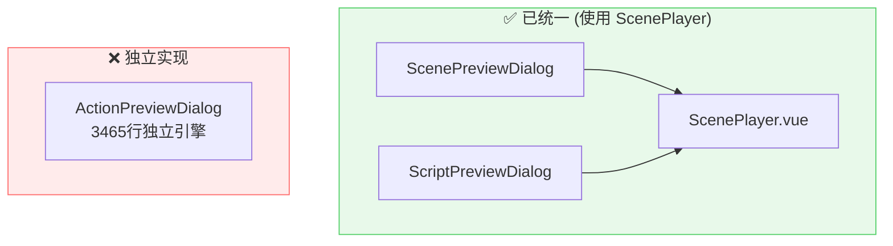
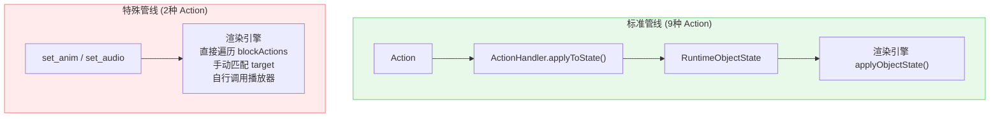
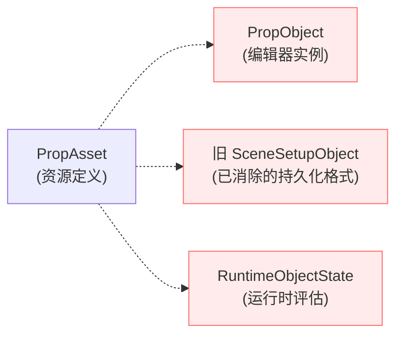
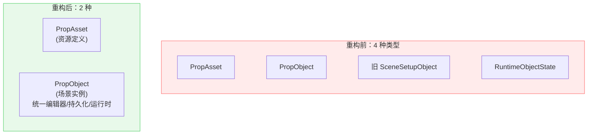
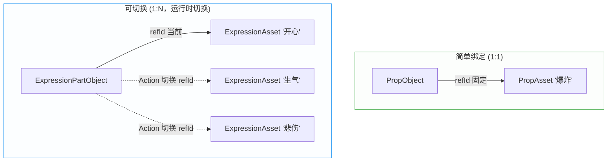
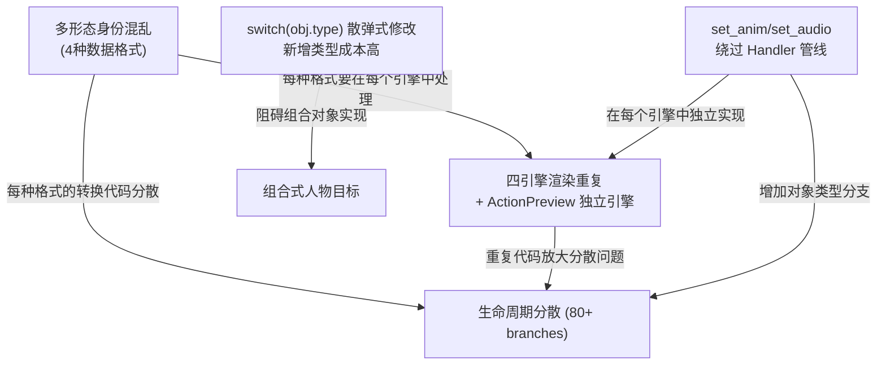
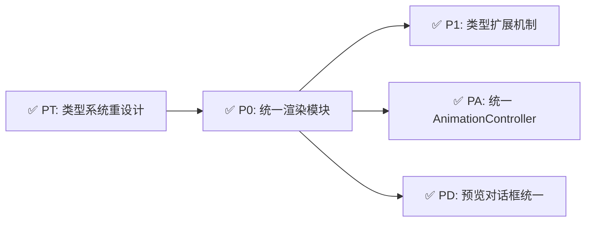

# FunnyAnimationAssistant 架构重构分析

> **日期**：2026-02-27（更新）  
> **目的**：分析当前架构问题，给出渐进式重构方案

---

## 一、多形态身份混乱

同一主体在系统中存在 **4 种不同类型形态**，字段命名不一致：

| 资源 |   资源定义ID    |         编辑器引用字段          |   持久化引用字段    |
| ---- | :-------------: | :-----------------------------: | :-----------------: |
| 道具 | `PropAsset.id`  |       `PropObject.propId`       | `SceneObject.refId` |
| 背景 | `Background.id` | `BackgroundObject.backgroundId` | `SceneObject.refId` |
| 角色 | `Character.id`  |  `CharacterObject.characterId`  | `SceneObject.refId` |
| 音效 | `SoundAsset.id` |       `AudioObject.refId`       | `SceneObject.refId` |

> 只有 `AudioObject` 碰巧与 `SceneObject` 使用相同字段名 `refId`，其他三种全部不一致。

**人物属性的嵌套差异尤为严重**：`CharacterObject.pose` vs `initialState.pose` vs `RuntimeObjectState.pose`。

---

## 二、生命周期分散

`type === 'character'` 在非测试代码中出现 **80+ 次，分布在 15+ 个文件**：

| 阶段        | 文件                                                                                                                                                                                                       | 分支数 |
| ----------- | ---------------------------------------------------------------------------------------------------------------------------------------------------------------------------------------------------------- | :----: |
| 加载/解析   | [sceneLoader.ts](../../src/utils/sceneLoader.ts#L46-L119)                                                                                                            |   2    |
| 持久化/保存 | [sceneLoader.ts](../../src/utils/sceneLoader.ts#L286-L368)                                                                                                           |   1    |
| 对象创建    | [sceneObjectStore.ts](../../src/stores/sceneObjectStore.ts#L95-L183)                                                                                                 |   1    |
| 编辑器容器  | [useSceneGraph.ts](../../src/composables/useSceneGraph.ts)                                                                                                           |   5+   |
| 编辑器状态  | [useSceneRenderer.ts](../../src/composables/useSceneRenderer.ts)                                                                                                     |   11   |
| 预览渲染    | [ScenePlayer.vue](../../src/components/screenplay/ScenePlayer.vue)                                                                                                   |   8+   |
| 视频导出    | [FrameCapture.ts](../../src/utils/videoExport/FrameCapture.ts)                                                                                                       |   8    |
| 状态计算    | [stateUtils.ts](../../src/utils/stateUtils.ts)                                                                                                                       |   3    |
| 资源收集    | [exportAdapter.ts](../../src/utils/exportAdapter.ts), [ResourcePreloader.ts](../../src/utils/videoExport/ResourcePreloader.ts) |   4+   |
| UI          | ObjectPropertiesPanel, SetupEditor, AssetCard...                                                                                                                                                           |   4+   |

> **散弹式修改成本**：新增一个人物字段 = 修改 **7+ 文件 / 12+ 处**。若引入对象 Handler 模式 = **3 处**。

---

## 三、四引擎渲染重复 + ActionPreviewDialog 独立引擎

### 3.1 四引擎问题

| #   | 引擎       | 文件                                                                                                     | 行数  |
| --- | ---------- | -------------------------------------------------------------------------------------------------------- | :---: |
| 1   | 编辑器容器 | [useSceneGraph.ts](../../src/composables/useSceneGraph.ts)         | 1594  |
| 2   | 编辑器状态 | [useSceneRenderer.ts](../../src/composables/useSceneRenderer.ts)   | 1666  |
| 3   | 预览播放   | [ScenePlayer.vue](../../src/components/screenplay/ScenePlayer.vue) | 2044  |
| 4   | 视频导出   | [FrameCapture.ts](../../src/utils/videoExport/FrameCapture.ts)     | 1207  |

每个引擎独立实现 `renderCharacter/renderBackground/renderProp/renderScreenEffect` + `applyObjectState` 的全部类型分支。

### 3.2 ActionPreviewDialog 是第五个独立引擎

ScenePreviewDialog 和 ScriptPreviewDialog 已使用 ScenePlayer，但 [ActionPreviewDialog.vue](../../src/components/ActionPreviewDialog.vue)（**3465行**）完全独立实现了自己的渲染引擎：



ActionPreviewDialog 中约 **~1140行渲染代码**与 ScenePlayer 完全重复（`renderCharacter/Prop/Background`、`applyObjectState`、`applyAnimationControl` 等）。

### 3.3 统一方案：ActionPreviewDialog 改用 ScenePlayer

ActionPreviewDialog 本质上就是**播放场景中的一个 Block**。ScenePlayer 已拥有完整的场景数据，只需新增 `blockId` Props 即可支持单 Block 播放：

```typescript
// 改造后的 API — 极简
<ScenePlayer :episode="episode" :sceneId="sceneId" :blockId="blockId" />
```

ScenePlayer 内部自行完成：
- `calculatePrevContext(scene, blockId)` — 它已有场景数据，自己算
- `replayCarriedOverAnimations()` — 遍历前置 Block 的 actions，自己回溯
- 初始动画状态恢复 — 从 prevContext 中提取 `initialAnimations`

> **Dialog 只负责"告诉 ScenePlayer 播放什么"，渲染层的一切由 ScenePlayer 自行处理。**

### 3.4 移除 Seek 机制

ActionPreviewDialog 的进度条已是 `disabled` 状态，三个预览对话框都不需要 Seek。移除后 ScenePlayer 可完全采用**前向只进**模型，节省 ~230行状态重建代码。

### 3.5 统一后的代码量变化

| 组件                | 改造前 | 改造后 |        变化        |
| ------------------- | :----: | :----: | :----------------: |
| ActionPreviewDialog |  3465  |  ~700  |     **-2765**      |
| ScenePlayer         |  2866  | ~2600  |        -266        |
| **净变化**          |  6331  |  3300  | **-3031行 (-48%)** |

---

## 四、Animation 机制与 set_anim / set_audio 问题分析

### 4.1 核心问题：绕过 Handler 管线的"特殊 Action"

系统中共有 11 种 Action 类型。其中 9 种走标准的 **ActionHandler 策略模式**（Handler 注册 → `applyToState()` → `interpolate()`），但 `set_anim` 和 `set_audio` **完全绕过**了这条管线：



### 4.2 `set_anim` 三引擎重复的量化

| 引擎       | 文件                                                                                                                      | 行数  |
| ---------- | ------------------------------------------------------------------------------------------------------------------------- | :---: |
| 预览       | [ScenePlayer.vue](../../src/components/screenplay/ScenePlayer.vue#L1704-L1958)      |  254  |
| 导出       | [FrameCapture.ts](../../src/utils/videoExport/FrameCapture.ts#L1386-L1660)          |  274  |
| Action预览 | [ActionPreviewDialog.vue](../../src/components/ActionPreviewDialog.vue#L2412-L2660) | ~250  |

三者结构几乎完全相同，但各有微小差异（FrameCapture 额外管理 `_shouldPlay`、ScenePlayer 有 AnimatedSprite fallback），导致 bug 修复需同步 3 处。

### 4.3 `set_audio` 问题更严重

ScenePlayer 的 `updateAudio()` 180行音频状态机**完全不可复用**。VideoExporter 另有 120行独立实现。

### 4.4 改善建议

- **建议 1**：将 `set_anim` 纳入 Handler 管线，使 `activeAnimations` 成为状态的一部分
- **建议 2**：提取共享 `AnimationController`，三引擎 ~780行降至 ~150行
- **建议 3**：提取共享 `AudioController`，统一音频状态机
- **建议 4**：简化 Animation 播放器层级（内部 AnimationPlayer + 统一 ObjectAnimationPlayer）

---

## 五、类型系统重设计：Asset + SceneObject 二元模型

### 5.1 现状：同一主体 4 种类型



### 5.2 核心概念：Asset 与 SceneObject

|              | **Asset（资源）**                        | **SceneObject（场景对象）**                  |
| ------------ | ---------------------------------------- | -------------------------------------------- |
| **本质**     | "这个东西**是什么**"（资源定义）         | "这个东西在场景中**怎么样**"（实例）         |
| **内容**     | URL/帧序列、FPS、缩略图、部件定义        | 位置、缩放、旋转、透明度、姿态               |
| **生命周期** | 项目级，用户在资源管理器中创建，基本不变 | 场景级，随 Action 不断变化                   |
| **数量关系** | 一个 Asset 可产生多个 SceneObject        | 每个 SceneObject 通过 `refId` 引用一个 Asset |

SceneObject 在系统中的两个**相位**——同一个类型，不同的值：

```
PropObject (初始值)  ──Action评估──→  PropObject (当前值)
{ x:100, alpha:1.0 }                 { x:300, alpha:0.5 }
     ↑                                    ↑
  持久化到 .FunnyAnimationAssistant                   渲染引擎使用
```

### 5.3 重构后：从 4 种 → 2 种

消除旧的 `SceneSetupObject` 中间格式（合并进各 XxxObject）和 `RuntimeObjectState`（评估器直接输出 SceneObject）。



### 5.4 统一资源基类：静态 / 动态两种形态

表情、道具、背景都可能是**静态图片**或**帧动画**，因此 Asset 应有统一基类：

```typescript
// ═══════ 资源基类 ═══════
interface VisualAsset {
  id: string
  name: string
  type: 'static' | 'animated'   // 静态图片 or 帧动画
  url?: string                   // 静态：单张图片路径
  frames?: string[]              // 动画：帧序列路径列表
  fps?: number                   // 动画：播放帧率
  loop?: boolean                 // 动画：是否循环
  thumbnail?: string             // 缩略图
}

// ═══════ 各类资源特化 ═══════
interface PropAsset extends VisualAsset { /* 道具，目前无额外字段 */ }
interface BackgroundAsset extends VisualAsset { /* 背景，目前无额外字段 */ }
interface ExpressionAsset extends VisualAsset { /* 表情，目前无额外字段 */ }
interface PartAsset extends VisualAsset {
  partType: 'hand' | 'head' | 'body' | 'accessory'  // 部位类型标识
}
```

> 渲染层根据 Asset 的 `type` 自动选择 `PIXI.Sprite`（静态）或 `PIXI.AnimatedSprite`（动画），对 SceneObject 透明。

### 5.5 资源引用模型：简单绑定 vs 可切换

SceneObject 通过 `refId` 引用 Asset，存在两种模式：

| 模式               | refId 含义           | 切换方式          | 典型场景           |
| ------------------ | -------------------- | ----------------- | ------------------ |
| **简单绑定** (1:1) | 固定指向一个 Asset   | 不切换            | 道具、背景、音效   |
| **可切换** (1:N)   | 指向当前活跃的 Asset | Action 更新 refId | 表情部件、手部部件 |



**核心原则**：
- `refId` 始终指向**当前正在使用的资源 ID**
- 对象的 `type` 决定它可以切换哪类资源（类型约束）
- 切换资源 = Action 更新 `refId`：`{ type: "set_asset", target: "obj_001", params: { refId: "new_asset_id" } }`
- 不需要额外的 `activeAssetId` 字段

### 5.6 类型设计：共享基类 + 类型特化

```typescript
// ═══════ 共享基类（所有可视对象）═══════
interface SceneObjectBase {
  id: string
  type: string
  refId: string              // 当前引用的资源 ID（可通过 Action 切换）
  x: number; y: number
  scaleX: number; scaleY: number
  rotation: number; alpha: number
  visible: boolean; spawned: boolean
  zIndex: number; flipX: boolean

  // 组合对象支持（方案 B：平铺 + parentId）
  parentId?: string          // 父组合对象 ID，顶层对象无此字段（undefined）
}

// ═══════ 现有类型特化 ═══════
interface CharacterObject extends SceneObjectBase {
  type: 'character'
  pose: string
  expression: string
  layerPresetId?: string
  partAssetOverrides?: Record<string, string>
}

interface PropObject extends SceneObjectBase {
  type: 'prop'
}

interface BackgroundObject extends SceneObjectBase {
  type: 'background'
}

interface AudioObject {  // 音频无几何属性，不继承 SceneObjectBase
  type: 'audio'
  id: string; refId: string
  playbackState: 'play' | 'stop'
  volume: number; loop: boolean; spawned: boolean
}

interface ScreenEffectObject extends SceneObjectBase {
  type: 'screen_effect'
  effectType: string
  width: number; height: number
  openRatio?: number
}

// ═══════ 组合对象 ═══════
interface CompositeObject extends SceneObjectBase {
  type: 'composite'
  childIds: string[]          // 子对象 ID 列表
}

// ═══════ 组合式人物部件 ═══════
interface ExpressionPartObject extends SceneObjectBase {
  type: 'expression_part'       // refId → 当前表情 ExpressionAsset
}

interface CharacterPartObject extends SceneObjectBase {
  type: 'character_part'
  partType: string              // 部位标识（hand/head/body...）
  // refId → 当前部件变体 PartAsset（拳头/手掌/手指动画...）
}

// ═══════ 联合类型 ═══════
type SceneObject = CharacterObject | PropObject | BackgroundObject
                 | AudioObject | ScreenEffectObject
                 | CompositeObject
                 | ExpressionPartObject | CharacterPartObject
```

### 5.7 兼容性分析：表情场景对象

| 问题                           | 分析                                                                |
| ------------------------------ | ------------------------------------------------------------------- |
| 表情能否自由切换所有表情资源？ | ✅ `refId` 直接指向 ExpressionAsset ID，切换就是 Action 更新 `refId` |
| 表情资源有静态和动画两种？     | ✅ VisualAsset 基类统一支持 `static`/`animated`，渲染层透明处理      |
| 可用表情范围如何约束？         | 由 `type: 'expression_part'` 约束只能引用 ExpressionAsset           |

### 5.8 兼容性分析：人物部位场景对象

| 问题                                     | 分析                                                                           |
| ---------------------------------------- | ------------------------------------------------------------------------------ |
| 一个部位多种资源（拳头/手掌/手指动画）？ | ✅ 每种变体是一个 PartAsset，`refId` 指向当前活跃的变体                         |
| 混合静态和动画？                         | ✅ 拳头.png 是 `type:'static'`，手指动画/ 是 `type:'animated'`，渲染层自动区分  |
| 切换控制？                               | ✅ `{ type: "set_asset", target: "hand_001", params: { refId: "fist_asset" } }` |

### 5.9 评估器签名统一

```typescript
// 重构前：输入输出类型不同
function evaluateObjectState(setup: SceneObject, ...): RuntimeObjectState

// 重构后：输入输出同类型，值不同
function evaluateObjectState(initial: SceneObject, ...): SceneObject
```

### 5.10 资源管理分工

不同类型的 SceneObject 由其 `type` 决定去哪个 Store 查找对应的 Asset：

| SceneObject.type  | 资源由谁管理                        | 查询方式                               |
| ----------------- | ----------------------------------- | -------------------------------------- |
| `prop`            | PropStore                           | `propStore.getProp(refId)`             |
| `background`      | BackgroundStore                     | `backgroundStore.getBackground(refId)` |
| `audio`           | SoundStore                          | `soundStore.getSound(refId)`           |
| `symbol`          | 对象自包含素材列表                  | `SymbolObject.materials`               |
| `expression`      | ExpressionStore                     | `expressionStore.getExpression(refId)` |
| `composite`       | 场景对象树                          | `childIds` / `parentId`                |
| `mask`            | 无外部资源                          | `targetIds` 引用被裁切对象             |

> SceneObject 的数据模型只存 `refId`，不关心资源如何管理——这是 Store 层的职责。

### 5.11 Asset / Store / SceneObject 三者关系

|            | **Asset**（数据）             | **Store**（管理器）                         | **SceneObject**（场景实例）       |
| ---------- | ----------------------------- | ------------------------------------------- | --------------------------------- |
| **是什么** | 一条资源记录                  | Pinia 单例仓库                              | 资源在场景中的一个放置            |
| **类比**   | 数据库中的一行                | 数据库表的 DAO                              | 该数据的一次引用实例              |
| **数量**   | 项目中可有 N 个               | 全局唯一                                    | 场景中可有 M 个                   |
| **内容**   | `{ id, url, fps, frames... }` | `getProp()`, `createProp()`, `deleteProp()` | `{ refId→Asset, x, y, scale... }` |

> Asset 和 Store 是**不可合并**的——前者是数据，后者是管理数据的行为。

### 5.12 项目文件格式影响分析

当前持久化结构与重构目标的匹配度：

| 已有字段                                  |   匹配度   |
| ----------------------------------------- | :--------: |
| `id` + `refId` + `type`                   | ✅ 完全一致 |
| 几何属性 (`x/y/scale/rotation/alpha/...`) | ✅ 已在顶层 |
| 生命周期 (`spawned/visible`)              | ✅ 完全一致 |
| `initialAnimations`                       | ✅ 不受影响 |

需要调整的部分：

| 问题         | 当前                         | 重构后                                                           |       难度       |
| ------------ | ---------------------------- | ---------------------------------------------------------------- | :--------------: |
| 角色状态嵌套 | `initialState.pose`          | `pose` 提至顶层                                                  |        低        |
| 类型字段混杂 | 所有类型字段在同一 interface | discriminated union 按 type 分发                                 | 低（纯类型变更） |
| 组合对象支持 | 无                           | 新增 `parentId` 字段（基类）+ `childIds` 字段（CompositeObject） |        低        |

> **结论：不需要重大文件格式变更。** 唯一迁移是 `initialState` 嵌套展平，通过加载时兼容处理（读取时展平，保存时写顶层）实现平滑迁移。

---

## 六、类型扩展机制：Provider Map 模式

### 6.1 问题：switch(obj.type) 的散弹式修改

当前 `switch (obj.type)` 分布在 8 个文件、约 35 个 case 分支中。新增一个类型需修改全部 8 个文件：

| 文件                                         | switch 站点 | 职责         |
| -------------------------------------------- | :---------: | ------------ |
| `sceneObjectStore.ts` — `toSetupObject`      |   7 cases   | 序列化       |
| `sceneObjectStore.ts` — `fromSetupObject`    |   5 cases   | 反序列化     |
| `useSceneGraph.ts` — `createObjectContainer` |   6 cases   | 编辑器渲染   |
| `FrameCapture.ts` — 创建容器                 |   4 cases   | 视频导出渲染 |
| `AnimationController.ts`                     |   3 cases   | 动画初始化   |
| `animationStore.ts`                          |   6 cases   | 动画管理     |
| `SetupEditor.vue`                            |   UI 分支   | 编辑器面板   |
| `ObjectPropertiesPanel.vue`                  |   UI 分支   | 属性面板     |

**组合式人物需新增 3 种类型（`composite`、`character_part`、`expression_part`），总计 24+ 处需修改。**

### 6.2 方案：分层 Provider Map

在每个 switch 站点各自引入轻量的 Provider Map，用注册替代枚举：

#### 渲染层 — ContainerFactory Map

```typescript
type ContainerFactory = (obj: SceneObject, ctx: RenderContext) => Promise<PIXI.Container | null>
const containerFactories = new Map<SceneObjectType, ContainerFactory>()

// 注册（每种类型一行）
containerFactories.set('background', createBackgroundContainer)
containerFactories.set('character', createCharacterContainer)
containerFactories.set('composite', createCompositeContainer)

// 使用（替代 switch）
async function createObjectContainer(obj: SceneObject) {
  const factory = containerFactories.get(obj.type)
  if (!factory) throw new Error(`未注册的对象类型: ${obj.type}`)
  return factory(obj, context)
}
```

#### 序列化层 — TypeSerializer Map

```typescript
interface TypeSerializer {
  serialize(obj: SceneObject): Record<string, unknown>
  deserialize(data: Record<string, unknown>, ctx: DeserializeContext): void
}
const serializers = new Map<SceneObjectType, TypeSerializer>()
```

#### UI 层 — 动态面板组件

```typescript
const panelComponents: Record<SceneObjectType, Component> = {
  'character': CharacterPropertiesPanel,
  'background': BackgroundPropertiesPanel,
  'composite': CompositePropertiesPanel,
}
// 模板中：<component :is="panelComponents[obj.type]" />
```

### 6.3 新增类型的改动量对比

|               |   无 Provider Map    |           有 Provider Map           |
| ------------- | :------------------: | :---------------------------------: |
| 新增 1 种类型 |    修改 8 个文件     | 注册 3 行 + 新建 1 个 Provider 文件 |
| 新增 3 种类型 | 修改 8 个文件 24+ 处 |       新建 3 个 Provider 文件       |

---

## 七、问题关系图



---

## 八、当前架构的正面因素

| 模块                     | 状态  | 说明                                                                   |
| ------------------------ | :---: | ---------------------------------------------------------------------- |
| Action Handler 策略模式  |   ✅   | 9 个 Handler 独立文件，注册中心                                        |
| SceneObjectRenderer 统一渲染 |   ✅   | 编辑器、预览、导出复用统一对象渲染器                                   |
| Slot/Action 时间管线     |   ✅   | 数据流清晰                                                             |
| AnimationPlayer 核心     |   ✅   | 多轨道评估、Progress-Based 时间模型                                    |
| SceneObjectBase 接口设计 |   ✅   | 纯数据 POJO + discriminated union，与 Vue 响应式和 JSON 序列化完美兼容 |

---

## 九、渐进式重构方案



### PT: 类型系统重设计 ✅ 已完成

统一为 **Asset + SceneObject** 二元模型：
- ✅ `SceneSetupObject` 已消除，合并进各 XxxObject 子类型
- ✅ 运行时状态快照已统一为 `SceneObject` 形态，并由 `stateUtils.ts` 构建
- ✅ 统一 `refId` 字段（`propId`/`backgroundId`/`characterId` 已消除）
- ✅ 各类型特化继承 `SceneObjectBase`，TypeScript discriminated union 保证类型安全

实现文件：
- [sceneObject.ts](../../src/types/sceneObject.ts) — 当前包含 background/audio/prop/text/camera/light/screen_effect/composite/symbol/expression/mask 等类型，统一 `refId`
- [stateUtils.ts](../../src/utils/stateUtils.ts) — 构建对象运行时状态快照

### P0: 统一渲染模块 ✅ 已完成

`src/core/SceneObjectRenderer.ts`：
- ✅ `createPropContainer()` — 道具容器创建（静态 + 帧动画）
- ✅ `createBackgroundContainer()` — 背景容器创建（自动缩放到 CANVAS_HEIGHT）
- ✅ `applyObjectState()` — 统一状态应用（含 composite/symbol/expression/mask/light/text/screen_effect 等子类型分发）
- ✅ `applyCameraTransform()` — 相机变换
- ✅ `measureObjectDimensions()` — 尺寸测量
- ✅ `ObjectStateHost` 接口——各引擎通过实现此接口桥接缓存

实现文件：[SceneObjectRenderer.ts](../../src/core/SceneObjectRenderer.ts)

### P1: 类型扩展机制 ✅ 已完成

引入 Provider Map 消除 `switch(obj.type)`：
- ✅ 渲染层：`ContainerFactory` Map — 注册中心 + 当前对象类型工厂已注册，`createObjectContainer` 已用 Provider Map 分发
- ✅ 序列化层：`TypeSerializer` Map — 注册中心 + 当前对象类型序列化器，`toSetupObject`/`fromSetupObject` 已用 registry 分发
- ✅ UI 层：`SceneObjectTypeMetadata` 注册表 — 统一图标/标签/`AnimationResourceType` 映射
- 新增类型只需注册 + 新建 Provider 文件

实现文件：
- [sceneObjectProviders/index.ts](../../src/core/sceneObjectProviders/index.ts) — ContainerFactory 注册中心（74 行）
- [serialization/index.ts](../../src/core/sceneObjectProviders/serialization/index.ts) — TypeSerializer 注册中心（120 行）
- [serialization/](../../src/core/sceneObjectProviders/serialization/) — background/prop/audio/composite/screen_effect/symbol/expression/mask/light/text 等序列化器
- [metadata.ts](../../src/core/sceneObjectProviders/metadata.ts) — 类型元数据注册表（80 行）

### PA: 统一 AnimationController + AudioController ✅ 已完成

- ✅ `AnimationController`（729 行）— 统一动画命令处理，通过 `AnimationHost` 接口桥接各引擎
- ✅ `AudioController`（204 行）— 统一音频状态计算纯函数 `computeAudioState()`
- ✅ 含完整单元测试（`AnimationController.spec.ts` + `AudioController.spec.ts`）

实现文件：
- [AnimationController.ts](../../src/core/AnimationController.ts)
- [AudioController.ts](../../src/core/AudioController.ts)

### PD: 预览对话框统一 ✅ 已完成

- ✅ ActionPreviewDialog 已改用 ScenePlayer，当前约 632 行，职责收敛为弹窗与 blockId 播放入口
- ✅ ScenePlayer 支持 `blockId` Prop 的单 Block 播放模式
- ✅ Seek 机制已移除

实现文件：[ActionPreviewDialog.vue](../../src/components/ActionPreviewDialog.vue)

---

## 十、总结

| 问题                                    | 严重程度 | 方案                             | 实现状态 |
| --------------------------------------- | :------: | -------------------------------- | :------: |
| 同一主体 4 种类型（含 ID 不一致）       | **HIGH** | PT: Asset + SceneObject 二元模型 | ✅ 已完成 |
| 对象生命周期分散 (15+ 文件 80+ 分支)    | **HIGH** | PT + P0 联合解决                 | ✅ 已完成 |
| 四引擎渲染重复 + ActionPreview 独立引擎 | **HIGH** | P0 + PD                          | ✅ 已完成 |
| set_anim/set_audio 绕过 Handler 管线    | **HIGH** | PA: 提取 AnimationController     | ✅ 已完成 |
| ActionPreviewDialog 3465行独立引擎      | **HIGH** | PD: 改用 ScenePlayer (-76%)      | ✅ 已完成 |
| switch(obj.type) 散弹式修改             | **HIGH** | P1: Provider Map 模式            | ✅ 已完成 |

| Animation 30+ 轮迭代演进债务            |   MED    | PA 中顺带清理                    | ✅ 已完成 |
