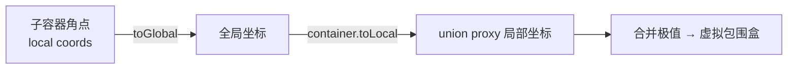
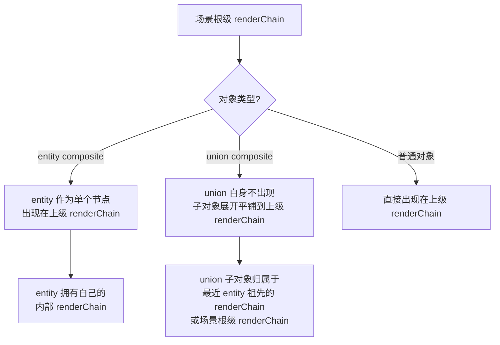

# Composite 对象边界计算与 RenderChain 归属规则

## 1. Union Composite 的虚拟边界计算

### 1.1 问题背景

Union composite 的 PIXI Container 是一个**空代理容器** (`renderable = false`)，子对象被平铺到上级容器而非嵌套在其中。因此：

- `container.getLocalBounds()` → 返回 `width = 0, height = 0`
- 所有依赖 `getLocalBounds()` 的边界计算对 union 均失效

### 1.2 `getContainerOrUnionBounds()` — 编辑器交互专用

**位置**: [useSceneRenderer.ts](../../src/composables/useSceneRenderer.ts#L114-L149)

**算法**:
1. 判断对象是否为 union composite
2. 非 union → 直接返回 `container.getLocalBounds()`
3. union → 遍历 `childIds`，对每个子容器：
   - 获取子容器 `getLocalBounds()` 的 4 个角点
   - 通过 `cc.toGlobal(corner)` → `container.toLocal(global)` 坐标换算
   - 合并所有角点的极值得到虚拟包围盒



**调用场景** (共 2 处):

| 调用处 | 用途 |
|--------|------|
| [handleResizeMove L547](../../src/composables/useSceneRenderer.ts#L547) | 拖拽缩放时计算变换原点偏移 |
| [handleRotateMove L703](../../src/composables/useSceneRenderer.ts#L703) | 拖拽旋转时计算变换原点偏移 |

### 1.3 各路径边界获取对比

| 路径 | 边界来源 | Union 支持 |
|------|----------|-----------|
| **编辑器交互旋转/缩放** | `getContainerOrUnionBounds()` | ✅ 通过子容器角点坐标换算 |
| **编辑器 applyTransform** | `container.getLocalBounds()` | ❌ 返回 0 → TransformOrigin 补偿跳过 |
| **GenericAnimationPlayer** | `this.target.getLocalBounds()` | ❌ 返回 0 → pivot 补偿跳过 |
| **SceneObjectRenderer.measureObjectBounds** | 子对象位置计算 (已修复) | ✅ 从子对象 position+dims 计算 |

> [!IMPORTANT]
> 编辑器交互旋转正常工作是因为使用了**数学位置补偿**（直接修改 `obj.x/y` 保持变换点不动），而非依赖 PIXI pivot。
> 动画旋转使用 `GenericAnimationPlayer.applyOutputs` 的 pivot 补偿，依赖 `objectWidth/Height`，对 union 为 0 导致失效。

### 1.4 编辑器交互旋转的数学补偿公式

```
P_screen = obj.xy + R(θ) × S × offset

其中 offset = bounds.origin(transformOriginX, transformOriginY) 相对于容器原点的偏移

保持 P_screen 不变：
new_obj.xy = startXY + (R(startθ)×S×offset - R(newθ)×S×offset)
```

这是**绝对式计算**（从初始状态直接算最终位置），避免增量式 `Math.round` 舍入误差累积。

---

## 2. RenderChain 归属规则

### 2.1 数据结构

```typescript
// 场景根级渲染链
interface SceneSetup {
  renderChain: string[]  // 根级有序 ID 列表
}

// Entity composite 内部渲染链
interface CompositeObject {
  renderChain?: string[]  // 仅 entity 模式
}
```

### 2.2 核心规则



| 规则 | 说明 |
|------|------|
| **Entity composite** | 自身作为节点出现在上级 renderChain；内部拥有独立的 `renderChain` |
| **Union composite** | 自身**不出现**在任何 renderChain；子对象**展开平铺**到最近 entity 祖先的 renderChain 或场景根级 renderChain |
| **zIndex 有序不变量** | renderChain 中 `∀ i<j: zIndex[chain[i]] ≤ zIndex[chain[j]]` |

### 2.3 Union 子对象的 RenderChain 归属查找

[sceneObjectStore.findOwningRenderChain](../../src/stores/sceneObjectStore.ts#L1252-L1269):

```
union → 沿 parentId 向上穿透所有 union → 找到最近 entity 祖先 → entity.renderChain
                                         → 无 entity 祖先 → sceneRenderChain
```

### 2.4 渲染管线中的应用

[renderPipeline.ts L152-164](../../src/core/renderPipeline.ts#L152-L164):

```typescript
// entity: 按 renderChain 遍历，子对象嵌套到 container (CRT 离屏渲染)
// union: 按 childIds 遍历，子对象平铺到 parentContainer
const childOrder = (!isUnion && composite.renderChain?.length > 0)
    ? composite.renderChain
    : (composite.childIds ?? [])

const childTarget = isUnion ? parentContainer : container
```

| 属性 | Entity | Union |
|------|--------|-------|
| **遍历顺序** | `renderChain`（有序） | `childIds`（原始顺序） |
| **子对象挂载** | 嵌套到 entity 容器 | 平铺到上级容器 |
| **排序机制** | 按 renderChain 位置排序 | 由上级 renderChain 控制 |
| **离屏渲染** | CRT (CompositeRenderTarget) | 无 |

### 2.5 `buildRenderChain` 构建规则

[renderChainUtils.ts](../../src/utils/renderChainUtils.ts#L28-L49):

- **场景根级** (`parentId=undefined`): 收集无 parentId 的对象，union 递归展开
- **Entity 内部** (`parentId=entityId`): 收集 entity 的子对象，union 递归展开
- **排序**: 按 `(zIndex, originalIndex)` 双关键字排序
- **Union 展开**: `expandUnionChildren()` 递归展开嵌套 union

```
场景: [背景, entity_A, union_B(头部, 后发, union_C(表情))]

场景 renderChain = [背景, entity_A, 头部, 后发, 表情]
                    ↑       ↑       ↑     ↑     ↑
                 直接对象  entity  union_B子对象  union_C递归展开

entity_A.renderChain = [entity_A 的内部子对象...]
```
