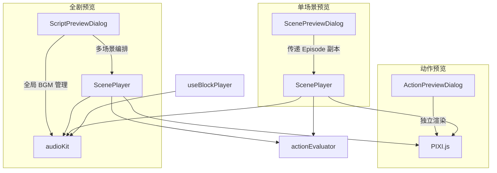
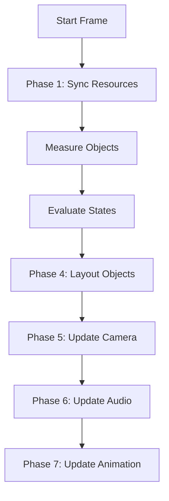
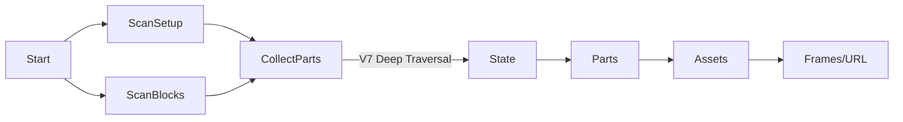

# 剧本预览对话框技术规范 (V7 State-Centric)

> 本文档描述 ScenePreviewDialog、ScenePlayer 及相关模块在 V7 State-Centric 架构下的功能需求与技术实现细节。
>
> **版本**: V7.57 (2026-01-11)
> **架构**: State-Centric Topology + 7-Phase Rendering Pipeline

---

## 1. 架构概览



| 组件                      | 职责                                                                               |
| ------------------------- | ---------------------------------------------------------------------------------- |
| `ScriptPreviewDialog.vue` | **全剧预览**：多场景编排、全局 BGM 时间线、跨场景无缝切换、全部资源统一预加载      |
| `ScenePreviewDialog.vue`  | **单场景预览**：资源预加载 (V7深度收集)、TTS 生成、Blob URL 管理、ScenePlayer 容器 |
| `ScenePlayer.vue`         | **7阶段渲染管线**、播放控制、动画状态管理、音频同步、字幕                          |

---

## 2. V7 State-Centric 数据模型

V7 架构将角色数据重构为 **状态中心化拓扑 (State-Centric Topology)**，这是渲染和动作评估的核心基础。

| V7 概念          | 说明                                                                    | 对应代码                    |
| :--------------- | :---------------------------------------------------------------------- | :-------------------------- |
| **Ref ID**       | 场景对象通过 `refId` 关联到 Character/Prop 定义，而非旧的 `characterId` | `obj.refId`                 |
| **State**        | 角色可视化状态的核心容器 (Pose)，包含一组 Parts                         | `character.states[stateId]` |
| **Part**         | 构成角色的最小渲染单元 (Body, Head, Expression...)                      | `state.parts[]`             |
| **Layer Preset** | 动态层级配置，决定 Parts 的渲染顺序 (Z-Index)                           | `layerPresetId`             |
| **Overrides**    | 运行时动态覆盖特定 Part 的素材 (如表情切换)                             | `partAssetOverrides`        |

### 2.1 运行时对象状态 (RuntimeObjectState)

```typescript
interface RuntimeObjectState {
  // 基础变换
  x: number; y: number
  scaleX: number; scaleY: number
  rotation: number
  alpha: number
  visible: boolean
  flipX: boolean
  zIndex: number

  // V7 核心状态
  pose?: string              // 当前姿态 (State ID)
  expression?: string        // 当前表情 (映射到 expression part override)
  layerPresetId?: string     // 当前激活的层级预设
  partAssetOverrides?: Record<string, string> // 部件素材覆盖表 [partId -> assetId]
}
```

---

## 3. 七阶段渲染管线 (V7 Pipeline)

ScenePlayer 的每一帧更新遵循严格的 7 阶段管线，以确保状态的一致性和正确性。



| 阶段            | 函数                      | V7 关键逻辑                                                                                                                             |
| :-------------- | :------------------------ | :-------------------------------------------------------------------------------------------------------------------------------------- |
| **1. 资源同步** | `syncResources()`         | 使用 `obj.refId` 查找角色/道具定义；创建/销毁 PIXI 容器。                                                                               |
| **2. 对象测量** | `measureObjects()`        | 测量对象实际渲染尺寸，用于后续布局计算。                                                                                                |
| **3. 状态评估** | `evaluateStates()`        | 基于 Block 时间计算插值。**关键**: 必须保留 `partAssetOverrides` 和 `layerPresetId`，避免状态丢失。                                     |
| **4. 对象布局** | `layoutObjects()`         | 将计算出的状态应用到 PIXI 对象。处理 V7 的 `layerPreset` 应用和 `expression` 到 `partAssetOverrides` 的映射。                           |
| **5. 相机更新** | `updateCamera()`          | 评估 `camera_move/follow/shake` 动作。支持基于 `visualCenter` 的动态跟随。                                                              |
| **6. 音频更新** | `updateAudio()`           | 处理 `trigger_audio`，管理 AudioKit 实例，处理淡入淡出。                                                                                |
| **7. 动画控制** | `applyAnimationControl()` | **V7 新增**。处理 `trigger_anim` 动作，控制角色各部件 (`controlPartAnim`) 或道具 (`AnimatedSprite`) 的播放状态 (Play/Stop/Loop/Speed)。 |

---

## 4. 资源预加载 (Preloading)

为了支持 V7 的深层嵌套结构，资源收集逻辑已升级。

- **工具**: `useAssetLoader.collectAssets(setup, block)`
- **扫描范围**:
    1.  **Setup 阶段**: 扫描 `obj.initialState.pose` 对应的 State 及其所有 Parts 的默认 Assets。
    2.  **Runtime 阶段**: 扫描所有 Block 中 `set_character` 动作可能切换到的新 Pose 的 Assets。
    3.  **表情资源**: 扫描 `initialState.expression` 及动作中切换的 Expression，解析为对应的 Frame Assets。



---

## 5. Action 处理与时间计算

### 5.1 Action 分类
- **瞬时 (Point)**: `set_transform`, `set_character` (切换 pose/expression/layerPreset), `camera_cut`
- **持续 (Duration)**: `tween_transform`, `camera_move`, `camera_follow`, `camera_shake`
- **触发 (Trigger)**: `trigger_anim` (Phase 7 处理), `trigger_audio` (Phase 6 处理)

### 5.2 状态评估逻辑
V7 的 `evaluateObjectState` 不仅计算几何属性插值，还负责：
1.  **层级预设传递**: 确保 `layerPresetId` 在动作序列中正确传递。
2.  **素材覆盖合并**: 当发生 `set_character` 时，更新 `partAssetOverrides`。

---

## 6. 画布与相机

- **画布尺寸**: 2240 x 1400 (固定)
- **基准视口**: 1456 x 819 (16:9)
- **坐标系原点**: 左上角 (0, 0)
- **相机实现**: 通过 `contentViewport` 容器的 `pivot` (中心点) 和 `scale` (缩放) 模拟相机运动。

---

## 7. 文档维护

- **关联代码**:
    - `src/components/screenplay/ScenePlayer.vue`
    - `src/components/screenplay/ScenePreviewDialog.vue`
    - `src/utils/actionEvaluator.ts`
- **测试用例**: 该文档的技术实现由 `doc-test/scene_preview_test_cases.md` 中的测试用例集保障，特别是 `TC-SPD-*` 和 `REG-SPD-*` 系列。
