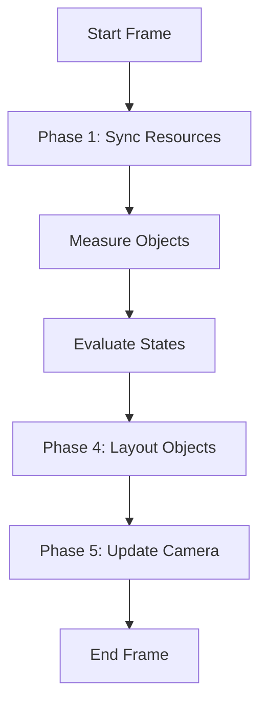

# 场景渲染管线设计文档 (Scene Rendering Pipeline)

## 1. 概述 (Overview)

本文档描述了 沙雕动画小助手 场景预览模块的全新渲染管线。该设计采用了 **Load (Sync) -> Measure -> Evaluate -> Layout -> Camera** 的五阶段循环模式，旨在解决资源加载不一致、动画状态重置、相机跟随抖动等问题，并提供更强的容错性和调试能力。

核心理念：**幂等性（Idempotency）**。每一帧的渲染逻辑都是自我修正的，确保画面最终一致。

## 2. 核心架构 (Core Architecture)

渲染循环（Game Loop）不再区分“初始化”和“更新”，而是统一为以下五个阶段的循环：

### 2.1 阶段一：资源同步 (Phase 1: Sync Resources / Load)

**职责**：确保所有活跃对象在画布上都有对应的 PIXI 实例，且纹理正确。
**频率**：每一帧执行，但仅在必要时触发 IO/创建操作。

*   **检查 (Check)**: 遍历当前帧需要显示的所有对象 ID。
*   **创建 (Create)**: 如果画布上不存在该 ID 的 Container，立即创建（`new Container` + `new Sprite`）。
*   **同步 (Sync)**: 检查该对象的当前素材 URL（如换装、换表情）是否与 Container 上的 Texture 一致。如果不一致，加载并替换 Texture。
*   **清理 (Sweep)**: 标记本帧未访问但已存在的 Container，将其移除（可选，或仅设为不可见）。

**关键点**：如果对象已存在且素材未变，此阶段耗时几乎为 0，不会阻塞渲染，也不会重置 `AnimatedSprite` 的播放状态。

### 2.2 阶段二：实时测量 (Measure Objects)

**职责**：基于最新的纹理获取对象的真实物理尺寸，计算几何中心。
**频率**：每一帧执行。

*   **前置检查**: 确保 Texture 已加载 (`valid` 为 true)。如果未加载，跳过测量，保持上一帧状态或使用默认值。
*   **测量 (Bounds)**: 调用 `container.getLocalBounds()` 获取真实包围盒。
    *   *优势*：即使动画播放导致包围盒尺寸变化，也能实时获取准确值。
*   **计算 (Pivot)**: 根据包围盒计算中心点（Pivot）。
    *   `pivotX = localBounds.x + localBounds.width / 2`
    *   `pivotY = localBounds.y + localBounds.height / 2`
*   **偏移 (Offset)**: 计算视觉修正偏移量，确保 (x,y) 坐标符合设计意图（如左上角对齐或底部中心对齐）。

### 2.3 阶段三：状态评估 (Evaluate States)

**职责**：根据当前时间戳，计算所有对象的中间状态（补间动画）。
**频率**：每一帧执行。

*   **快照 (Snapshot)**: 获取当前 Block 开始时的初始状态。
*   **计算 (Evaluate)**: 根据当前时间戳，计算所有 Action（补间动画）产生的中间状态（x, y, scale, rotation, alpha, pose, expression）。
*   **输出 (Output)**: 生成一个包含所有对象 `RuntimeObjectState` 的 Map，纯数据，不依赖 PIXI 对象。

### 2.4 阶段四：对象布局 (Phase 4: Layout Objects)

**职责**：将计算出的状态应用到 PIXI 对象上，并处理动画控制。
**频率**：每一帧执行。

*   **应用 (Apply)**: 将 阶段三 计算出的状态赋值给 Container。
    *   `container.position.set(targetX + offset, targetY + offset)`
    *   `container.scale.set(targetScale)`
    *   `container.rotation = targetRotation`
    *   `container.alpha = targetAlpha`
    *   `container.zIndex = targetZIndex`
*   **动画 (Animation)**: 处理 `trigger_anim` 等动画控制逻辑，实时计算 AnimatedSprite 的播放状态 (Loop/Speed/Action)。
*   **中心点 (Visual Center)**: 返回对象最终的视觉中心坐标，供后续相机更新使用。

### 2.5 阶段五：相机更新 (Phase 5: Update Camera)

**职责**：根据所有对象最终渲染的位置，计算并应用相机视口变换。
**频率**：每一帧执行，**必须在对象渲染之后**。

*   **收集 (Collect)**: 获取所有关注对象（如 `camera_follow` 的目标）在 Phase 4 结束后的最终世界坐标。
*   **计算 (Compute)**: 计算相机的目标位置（x, y）和缩放（zoom）。
*   **应用 (Transform)**: 设置 `stage.pivot` 和 `stage.scale`。

## 3. 关键优势 (Key Benefits)

1.  **容错性 (Fault Tolerance)**:
    *   即使第一帧资源加载失败，只要后续帧资源下载完成，Phase 1 会自动检测并显示对象，无需重启预览。
    *   动态添加/删除对象无需特殊逻辑，数据驱动自动同步。

2.  **动画稳定性 (Animation Stability)**:
    *   Phase 1 的“按需创建”避免了每帧销毁重建导致的动画重置问题。
    *   阶段二 的“实时测量”确保了即使动画导致包围盒变化，中心点依然准确，避免“鬼畜”抖动。

3.  **职责分离 (Separation of Concerns)**:
    *   **Evaluate** 阶段只负责纯数据计算，便于单元测试和状态回溯。
    *   **Layout** 阶段只负责视觉呈现，确保渲染逻辑的统一性。

4.  **调试友好 (Debuggability)**:
    *   渲染问题可以精准定位到特定阶段：
        *   对象没出来？ -> Phase 1 问题（资源/创建逻辑）。
        *   位置偏了？ -> 阶段二 问题（测量逻辑）或 阶段三 问题（计算逻辑）。
        *   画面抖动？ -> Phase 5 问题（相机更新时序）。

5.  **相机平滑 (Camera Smoothness)**:
    *   严格的 `Object -> Camera` 依赖顺序彻底解决了“相机跟随慢一帧”的问题。

## 4. 实现注意事项 (Implementation Notes)

*   **性能优化**: 在 Phase 1 中，务必使用高效的缓存检查（如 `Map<id, currentUrl>`），避免重复字符串比对。
*   **异步处理**: 纹理加载是异步的。在纹理未 Ready 之前，阶段二 获取的 Bounds 可能为 0，此时应跳过 Pivot 计算或使用默认值，防止除以零或位置跳变。
*   **动画状态**: 动画控制建议采用 "Initial State + Active Actions" 的实时计算模式，避免状态残留。
*   **垃圾回收**: 建议实现轻量级的对象池或清理机制，防止长时间运行导致内存泄漏。
