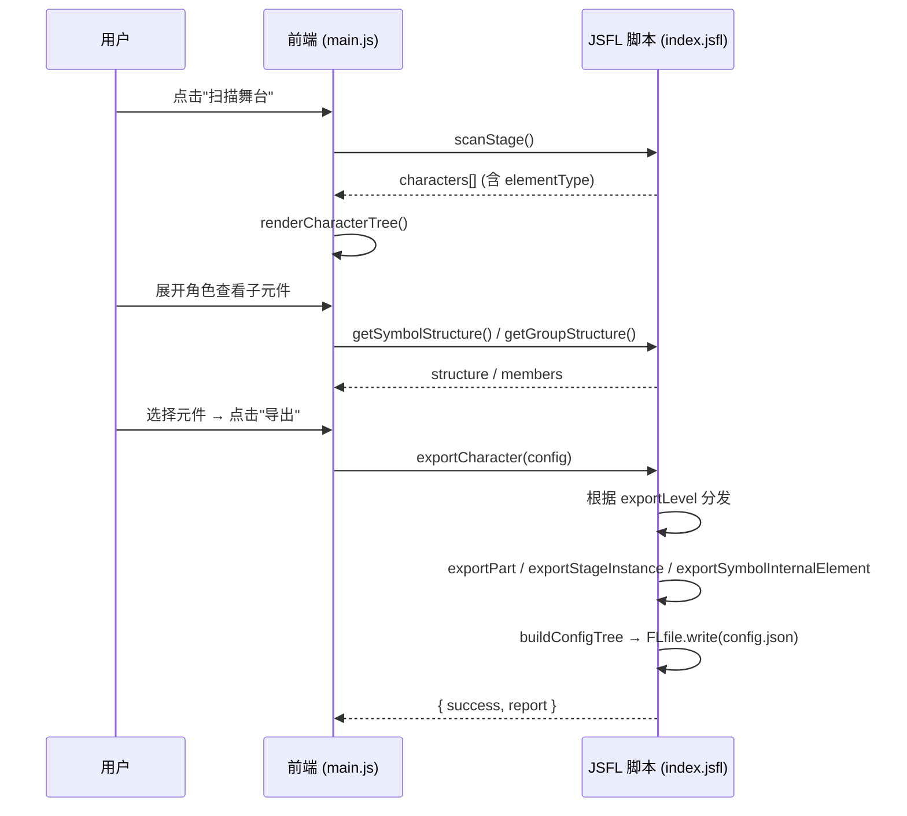

# 沙雕动画小助手 - 导出技术参考

> 本文档整合了导出系统的完整技术规范，涵盖导出流程、config.json 数据格式、坐标系统、
> 组/非符号元素导出策略以及各层级的导出行为。
>
> **版本**: 2026-03-13 — 基于 `index.jsfl` 与 `client/js/main.js` 当前实现同步更新
>
> **替代文档**: 本文档替代以下旧文档：
> - `export_config_documentation.md` — 已合并至本文档第 2-5 节
> - `export_format.md` — 已废弃（旧版 `trimOffset`/`bounds` 模型已被 `registrationPoint` 模型取代）
> - `export_strategy.md` — 已废弃（早期设计草案，已被实际实现超越）
> - `group_export_requirements_20260203.md` — 已归档（功能需求已全部落地）

---

## 1. 系统架构概述

### 1.1 技术栈

| 组件 | 文件 | 职责 |
|:-----|:-----|:-----|
| **前端 (CEP)** | `client/js/main.js` | UI 交互、任务编排、进度管理 |
| **JSFL 脚本** | `host/index.jsfl` | 舞台扫描、元件解析、PNG 导出、config.json 生成 |
| **UI 模板** | `client/index.html` | 面板界面（树形列表、类型筛选、缩放设置） |

### 1.2 导出流程



---

## 2. 支持的元素类型

| 元素类型   | elementType | 描述                              | 舞台扫描 | 二级/三级导出行为 |
|:-----------|:------------|:----------------------------------|:---------|:----------------|
| **Symbol** | `symbol`    | MovieClip 或 Graphic 元件         | ✅ 支持  | 展开内部结构递归导出 |
| **Group**  | `group`     | 通过 Ctrl+G 创建的组              | ✅ 支持  | 二级整体导出；三级视内部结构展开或扁平化 |
| **Bitmap** | `bitmap`    | 位图实例                          | ✅ 支持  | 单帧 PNG 导出 |
| **Text**   | `text`      | 文本元素                          | ✅ 支持  | 单帧 PNG 导出 |
| **Shape**  | `shape`     | 绘图对象                          | ⚠️ 仅内部 | 舞台直接 Shape 跳过（提示转元件），组/元件内部的 Shape 可导出 |

> [!NOTE]
> **Shape 限制**：`scanStage()` 跳过舞台上的独立 Shape 元素并输出日志提示。只有嵌套在 Symbol 或 Group 内部的 Shape 才会被 `analyzeElement()` 识别并参与导出。

---

## 3. 三级导出模型

### 3.1 导出层级定义

| 导出级别 | 目标 | 说明 |
|:---------|:-----|:-----|
| **Level 1** | 舞台根元素本身 | 将选中的一级元件整体导出为 PNG（保留舞台效果） |
| **Level 2** | 一级元件的子元素 | 分解导出各子部件（Symbol 展开、Group 扁平化、Bitmap/Text 直出） |
| **Level 3** | 子元素的孙元素 | 递归深入：Symbol 子元件继续展开，Group 视内部结构决定展开或扁平化 |

### 3.2 各元素类型在不同层级的行为

| 元素类型 | Level 1 | Level 2 | Level 3 |
|:---------|:--------|:--------|:--------|
| **Symbol (MC/Graphic)** | 整体导出（支持序列帧） | 分解子元素 | 递归分解孙元素 |
| **Group (无子组)** | 扁平化为单张 | 扁平化为单张 | 扁平化为单张 |
| **Group (含子组)** | 扁平化为单张 | 扁平化为单张 | 展开，子元素独立导出 |
| **Bitmap** | 单张 PNG | 单张 PNG | 单张 PNG |
| **Text** | 单张 PNG | 单张 PNG | 单张 PNG |
| **Shape** | 不支持(舞台级) | 通过 `exportSymbolInternalElement` 导出 | 同二级 |

### 3.3 组 (Group) 导出策略

**核心规则**：

- **二级导出时**：组始终作为整体扁平化导出（使用 `exportSymbolInternalElement`）
- **三级导出时**：检查 `containsSubGroups`：
  - `true` → 展开组，子元素独立导出（每个子元素调用 `exportGroupMember`）
  - `false` → 扁平化为单张 PNG

**含子组的展开行为**：展开时，组内的所有元素（包括非组成员如 Bitmap、Shape、Symbol）都作为独立 PNG 导出，与子组平级。

---

## 4. config.json 文件规范

### 4.1 生成时机与位置

**生成时机**：当一个一级元件的所有相关资源导出完成后，由 `exportCharacter()` 函数末尾调用 `buildConfigTree()` 生成并通过 `FLfile.write()` 写入。

**生成条件**：
- Level 1：仅多帧元件（有子目录）时生成，写入角色子目录
- Level 2/3：始终生成，写入角色根目录

**文件位置**：
```
[输出路径]/[角色名]/config.json
```

### 4.2 输出格式：树形结构

`config.json` 使用 `buildConfigTree()` 生成的**树形节点结构**（非扁平数组）。

#### 节点类型

| type 值 | 含义 | 使用场景 |
|:---------|:-----|:---------|
| `"composite"` | 容器节点（有子节点） | 根节点、三级导出中有子元件的二级部位 |
| `"symbol"` | 叶节点（导出了 PNG 的实际部件） | 所有最终导出为 PNG 的元素 |

#### 根节点字段

所有 config.json 的根节点（无论 Composite 还是 Symbol 类型）都包含以下通用字段：

| 字段 | 类型 | 说明 |
|:-----|:-----|:-----|
| `version` | String | 配置格式版本号，当前为 `"ver2.0.0"` |

**Composite 节点**：
| 字段 | 类型 | 说明 |
|:-----|:-----|:-----|
| `name` | String | 节点名称（角色名或部件名） |
| `type` | String | `"composite"` |
| `elementType` | String | 原始元素类型（`symbol`/`group`/`bitmap` 等） |
| `instanceTransform` | Object | 变换信息（仅三级导出的中间节点有此字段） |
| `children` | Array | 子节点数组 |

**Symbol（叶）节点**：
| 字段 | 类型 | 说明 |
|:-----|:-----|:-----|
| `name` | String | 部件名称 |
| `type` | String | `"symbol"` |
| `elementType` | String | 原始元素类型 |
| `frameCount` | Number | 导出帧总数 |
| `frames` | Array | 帧列表（详见 4.3） |
| `instanceTransform` | Object | 变换信息（详见 4.4） |
| `scaleFactor` | Number | 导出时的缩放比例（`1` 表示原始大小） |

### 4.3 帧列表结构 (frames)

所有元素类型使用统一的帧结构：

| 字段 | 类型 | 说明 |
|:-----|:-----|:-----|
| `keyframe` | Number | 所属关键帧的起始帧索引（0-based） |
| `frame` | Number | 当前帧的全局帧索引（0-based） |
| `label` | String\|null | 帧标签（关键帧上设置的标签） |
| `path` | String | 导出 PNG 的 浏览器可解析资源路径 |
| `type` | String | `"single"` / `"keyframe"` / `"tween"` |
| `subIndex` | Number | 补间帧在关键帧组内的序号（1-based，仅 `keyframe`/`tween` 类型有效） |

**帧类型说明**：
- `"single"` — 单帧关键帧（无补间动画），独立 PNG 文件
- `"keyframe"` — 多帧关键帧组的首帧
- `"tween"` — 关键帧组中的补间过渡帧

### 4.4 instanceTransform 结构

当前系统使用**统一的 registrationPoint 模型**：

```json
{
  "width": 349.55,
  "height": 356.25,
  "registrationPoint": {
    "parentX": 12.4,
    "parentY": -150.0,
    "localX": 174.75,
    "localY": 178.1
  },
  "scaleX": 1,
  "scaleY": 1,
  "rotation": 0
}
```

| 字段 | 说明 |
|:-----|:-----|
| `width`, `height` | 导出 PNG 的尺寸（最大包围盒，所有帧一致；Scale 已烘焙） |
| `registrationPoint.parentX` | 注册点在**父级坐标系**中的 X 位置 |
| `registrationPoint.parentY` | 注册点在**父级坐标系**中的 Y 位置 |
| `registrationPoint.localX` | 注册点在**导出 PNG 内**的 X 偏移（像素） |
| `registrationPoint.localY` | 注册点在**导出 PNG 内**的 Y 偏移（像素） |
| `scaleX`, `scaleY` | 归一化为 `1`（Scale 已烘焙到 `width`/`height`） |
| `rotation` | 旋转角度（度数） |

#### registrationPoint 的计算逻辑

**Symbol 元件**：
- `parentX/Y`：通过 `elem.x/y` 或 `matrix.tx/ty` 获取（注册点 + 十字在父坐标系的位置）
- `localX/Y`：由 `calculateMaxBounds()` 计算：`localX = -minLeft`, `localY = -minTop`

**Group / Bitmap / Text**：
- `parentX/Y`：使用元素的左上角 `elem.left/top`
- `localX/Y`：固定为 `0, 0`（左上角就是注册点）

> [!IMPORTANT]
> **Adobe Animate 的两种"点"**
>
> | 符号 | 名称 | API | 导出使用 |
> |:-----|:-----|:----|:---------|
> | **+** 十字 | 注册点 (Registration Point) | `elem.x/y` 或 `matrix.tx/ty` | ✅ 使用此点 |
> | **○** 圆圈 | 变换点 (Transform Point) | `elem.transformX/Y` | ❌ 不使用 |

#### 在渲染引擎中使用

```javascript
const { width, height, registrationPoint, scaleX, scaleY, rotation } = instanceTransform;
const { parentX, parentY, localX, localY } = registrationPoint;

// 设置锚点（以注册点为中心）
sprite.anchor.set(localX / width, localY / height);

// 设置位置（注册点在父级的位置）
sprite.position.set(parentX, parentY);

// 应用变换
sprite.scale.set(scaleX, scaleY);
sprite.rotation = rotation * Math.PI / 180;
```

---

## 5. 层级与渲染顺序 (Z-Index)

**tree children 的排列规则**：

- 二级导出时，图层按**倒序遍历**（`layers.length - 1` → `0`），使数组中底层元件在前、顶层元件在后
- 这意味着按数组索引 `0 → N` 依次绘制，后绘制的覆盖先绘制的（画家算法），即可获得正确的遮挡关系

---

## 6. Scale 烘焙机制

### 6.1 原理

为简化消费端处理，导出时将 Animate 中的 `scaleX/scaleY` 效果「烘焙」到 PNG 的实际像素尺寸中：

- **Symbol 导出** (`exportPart`)：通过 `bakeScaleX/Y` 参数调整临时文档中的实例缩放和舞台尺寸
- 导出后，`instanceTransform` 中的 `scaleX/scaleY` 归一化为 `1`
- `width/height` 已包含缩放效果的实际像素尺寸

### 6.2 非 Symbol 元素

Group/Bitmap/Text 使用 `buildInstanceTransformFromPart()`：
- 如果有 `bounds`（来自实际导出的 PNG），直接使用其 `width/height`
- `scaleX/scaleY` 同样归一化为 `1`

---

## 7. 目录结构示例

### 7.1 Level 1 导出

```
OutputFolder/
├── 角色名.png                     # 单帧 → 直接在根目录
# 或
├── 角色名/
│   ├── config.json                 # 多帧时生成
│   ├── 角色名_默认.png            # 单帧关键帧
│   └── 角色名_动作/              # 补间动画子目录
│       ├── 1.png
│       └── 2.png
```

### 7.2 Level 2 导出

```
OutputFolder/
├── 角色名/
│   ├── config.json
│   ├── 头部_默认.png              # 单帧部件 → 不创建子目录
│   ├── 头部_眨眼.png
│   ├── 图层_身体/                 # 多帧部件 → 创建图层子目录
│   │   ├── 身体_待机.png
│   │   └── 身体_走路/
│   │       ├── 1.png
│   │       └── 2.png
│   ├── 位图名.png                 # Bitmap 直出
│   └── 文本名.png                 # Text 直出
```

### 7.3 Level 3 导出

```
OutputFolder/
├── 角色名/
│   ├── config.json
│   ├── 图层_身体部位名/          # 二级 Symbol 的子目录
│   │   ├── 左手_默认.png         # 三级单帧
│   │   └── 右手_默认.png
│   ├── 组名/                     # 含子组的 Group → 展开
│   │   ├── 子部件1.png
│   │   └── 子部件2.png
│   └── 无子组的组.png            # 不含子组的 Group → 扁平化
```

---

## 8. config.json 完整示例

### Level 2 导出（简单 Symbol）

```json
{
  "version": "ver2.0.0",
  "name": "Robot_V1",
  "type": "composite",
  "children": [
    {
      "name": "Body",
      "type": "symbol",
      "elementType": "symbol",
      "frameCount": 1,
      "frames": [
        {
          "keyframe": 0,
          "frame": 0,
          "label": "idle",
          "path": "exports/Robot_V1/Body_idle.png",
          "type": "single"
        }
      ],
      "instanceTransform": {
        "width": 60,
        "height": 100,
        "registrationPoint": {
          "parentX": 0,
          "parentY": 0,
          "localX": 30,
          "localY": 50
        },
        "scaleX": 1,
        "scaleY": 1,
        "rotation": 0
      },
      "scaleFactor": 1
    },
    {
      "name": "Head",
      "type": "symbol",
      "elementType": "symbol",
      "frameCount": 2,
      "frames": [
        {
          "keyframe": 0,
          "frame": 0,
          "label": "normal",
          "path": "exports/Robot_V1/Head/Head_normal/1.png",
          "type": "keyframe",
          "subIndex": 1
        },
        {
          "keyframe": 0,
          "frame": 1,
          "label": "normal",
          "path": "exports/Robot_V1/Head/Head_normal/2.png",
          "type": "tween",
          "subIndex": 2
        }
      ],
      "instanceTransform": {
        "width": 51,
        "height": 60,
        "registrationPoint": {
          "parentX": 0,
          "parentY": -30,
          "localX": 25.5,
          "localY": 50
        },
        "scaleX": 1,
        "scaleY": 1,
        "rotation": 0
      },
      "scaleFactor": 1
    }
  ]
}
```

### Level 3 导出（含中间 composite 节点）

```json
{
  "version": "ver2.0.0",
  "name": "Character",
  "type": "composite",
  "children": [
    {
      "name": "Body",
      "type": "composite",
      "elementType": "symbol",
      "instanceTransform": { "..." : "二级部位的变换" },
      "children": [
        {
          "name": "Torso",
          "type": "symbol",
          "elementType": "symbol",
          "frameCount": 1,
          "frames": ["..."],
          "instanceTransform": { "..." : "三级部件的变换" },
          "scaleFactor": 1
        },
        {
          "name": "Arm",
          "type": "symbol",
          "elementType": "group",
          "frameCount": 1,
          "frames": ["..."],
          "instanceTransform": { "..." : "..." },
          "scaleFactor": 1
        }
      ]
    }
  ]
}
```

---

## 9. JSFL 核心函数参考

### 9.1 扫描与解析

| 函数 | 输入 | 输出 | 说明 |
|:-----|:-----|:-----|:-----|
| `scanStage()` | — | `{ characters[] }` | 扫描舞台所有可导出元素 |
| `getSymbolStructure(symbolName)` | 库元件名 | `{ structure: { layers[], name } }` | 解析 Symbol 内部层级 |
| `getGroupStructure(layerIdx, elemIdx, frameIdx, memberPath?)` | 舞台索引+路径 | `{ members[] }` | 解析 Group 内部成员 |
| `analyzeElement(elem, index, layerName, shallow)` | 元素对象 | part 信息 | 统一的元素分析（支持全部 5 种类型） |

### 9.2 导出

| 函数 | 用途 |
|:-----|:-----|
| `exportCharacter(configJson)` | 顶层编排函数，根据 exportLevel 分发到下面的具体导出函数 |
| `exportPart(configJson)` | 导出 Symbol 为 PNG 序列（创建临时文档，支持 Scale 烘焙） |
| `exportStageInstance(configJson)` | 导出舞台实例（保留滤镜、颜色效果等舞台变换） |
| `exportSymbolInternalElement(configJson)` | 进入元件编辑模式，导出内部的 Group/Bitmap/Text/Shape |
| `exportStageGroupMember(configJson)` | 导出舞台上 Group 的指定成员 |
| `exportGroupMember(configJson)` | 导出元件内部 Group 的指定成员 |

### 9.3 变换构建

| 函数 | 用途 |
|:-----|:-----|
| `buildInstanceTransform(options)` | 从原始参数构建 instanceTransform 对象 |
| `buildInstanceTransformFromPart(part, bounds)` | 为非 Symbol 元素构建（Scale 归一化） |
| `buildInstanceTransformForSymbol(part, bounds)` | 为 Symbol 元素构建（Scale 烘焙到尺寸） |
| `calculateMaxBounds(doc, symbolName, frameAnalysis)` | 计算元件所有帧的最大包围盒 + `regPointLocalX/Y` |
| `buildConfigTree(rootName, parts, exportLevel)` | 将扁平 parts 数组组装为树形 config 结构 |

---

## 10. 前端 (CEP) 交互要点

### 10.1 类型筛选

`appState.typeFilter` 支持按 `symbol`/`group`/`bitmap`/`text` 四种类型过滤显示和导出。

### 10.2 展开结构

- **Symbol** 和 **Group** 在 UI 树中都有「展开」按钮
- Symbol 展开调用 `getSymbolStructure()`，Group 展开调用 `getGroupStructure()`
- 嵌套 Group 支持多层展开（通过 `memberPath` 数组导航）

### 10.3 缩放模式

| 模式 | 说明 |
|:-----|:-----|
| `none` | 原始大小 |
| `ratio` | 按百分比缩放（10-1000%，默认 100%） |
| `custom` | 自定义目标宽高 |

缩放配置由前端传入 `exportCharacter()` 的 config 中，JSFL 端通过 `exportStageInstance` 或 `bakeScaleX/Y`（对 Symbol）实现。

---

## 附录 A：坐标系统图解

### 三层坐标关系

```
舞台 / 父元件坐标系
┌───────────────────────────────────────┐
│                                       │
│  registrationPoint.parentX/Y          │
│  ↓ (注册点在父级中的位置)              │
│  ✛══════════════════╗                 │
│  ║ 导出的 PNG        ║                 │
│  ║                   ║                 │
│  ║  localX/Y         ║                 │
│  ║  ↓ (注册点在PNG中) ║                 │
│  ║  ✛                ║                 │
│  ║                   ║  ← width        │
│  ╚══════════════════╝                 │
│        ↕ height                        │
└───────────────────────────────────────┘
```

### Symbol vs 非 Symbol 注册点对比

```
Symbol:                          Group/Bitmap/Text:
┌──────────────┐                 ┌──────────────┐
│              │                 ✛ (0,0)        │  ← localX=0, localY=0
│    ✛ (localX,│localY)          │              │     parentX=elem.left
│    注册点     │                 │              │     parentY=elem.top
│              │                 │              │
└──────────────┘                 └──────────────┘
```

---

## 附录 B：从旧格式迁移指南

如果消费端之前使用旧版 `export_format.md` 中描述的 `trimOffset`/`bounds` 格式，以下是字段对应关系：

| 旧字段 | 新字段 | 说明 |
|:-------|:-------|:-----|
| `instanceTransform.x` | `instanceTransform.registrationPoint.parentX` | 位置 X |
| `instanceTransform.y` | `instanceTransform.registrationPoint.parentY` | 位置 Y |
| `trimOffset.x` | `-instanceTransform.registrationPoint.localX` | 偏移反转（符号相反） |
| `trimOffset.y` | `-instanceTransform.registrationPoint.localY` | 偏移反转（符号相反） |
| `bounds.width` | `instanceTransform.width` | PNG 宽度 |
| `bounds.height` | `instanceTransform.height` | PNG 高度 |
| `bounds.left` | 已移除 | 由 `localX = -minLeft` 替代 |
| `bounds.top` | 已移除 | 由 `localY = -minTop` 替代 |
| *(根级)* `character` | `name` | 树形结构的根节点名称 |
| *(根级)* `exportLevel` | 已移除 | 树形结构通过 `type` 字段区分逻辑层级 |
| *(根级)* `parts[]` | `children[]` | 扁平数组 → 树形子节点 |
