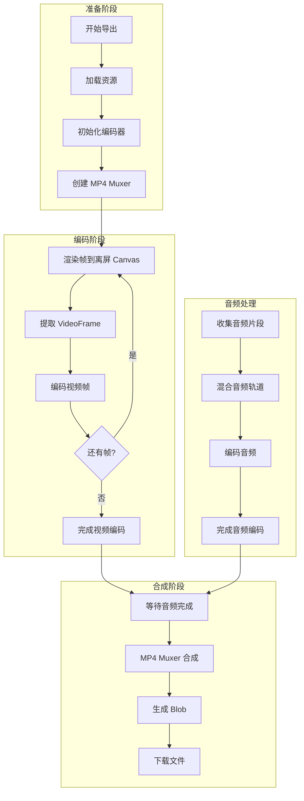
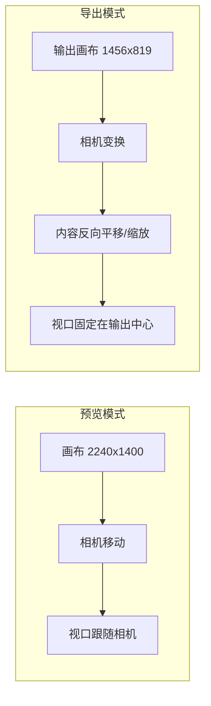
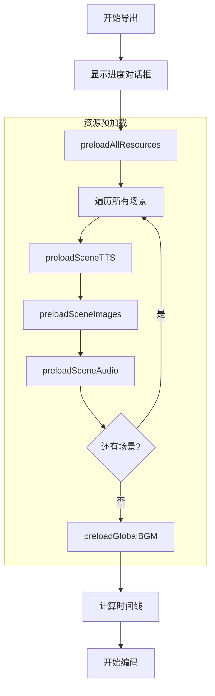
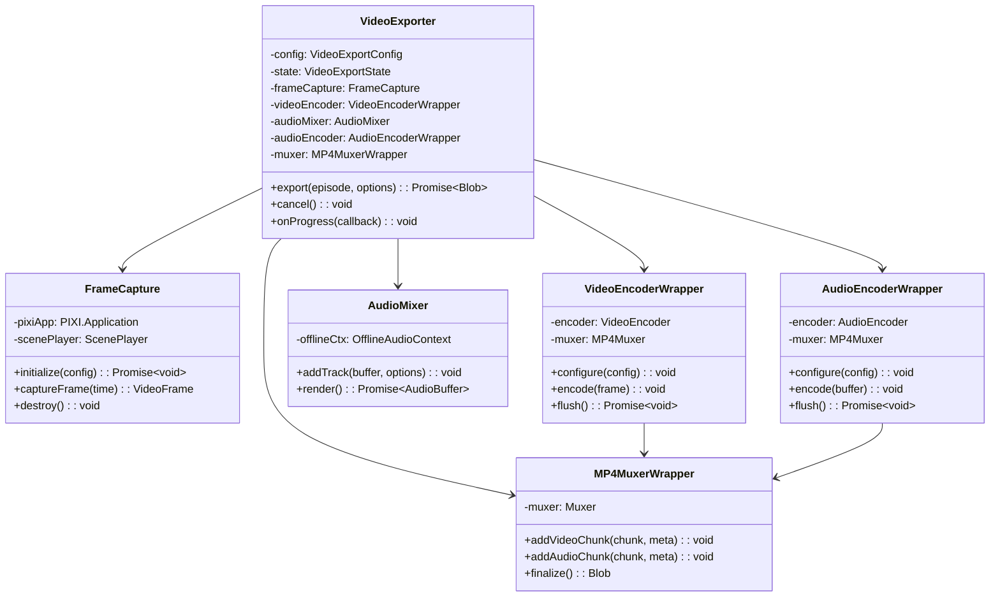
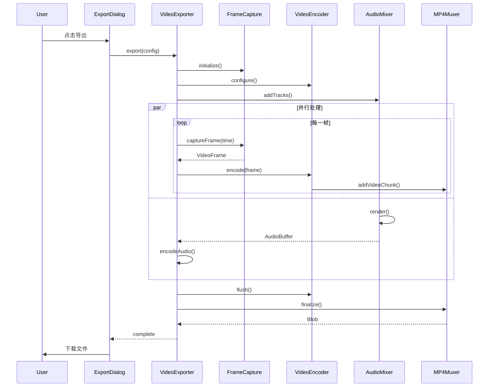

# 视频导出功能 - 产品需求文档 (PRD)

> 版本: v1.3 | 日期: 2025-12-27  

---

## 1. 功能概述

### 1.1 目标

将剧本预览对话框（ScriptPreviewDialog / ScenePreviewDialog）播放的内容导出为视频文件，包含：
- **视频轨道**：PIXI.js 画布渲染内容
- **音频轨道**：TTS 对白、旁白、BGM、SFX

### 1.2 核心价值

- 用户无需专业视频编辑软件即可生成可分享的动画视频
- 纯浏览器端处理，无需服务器参与，保护用户隐私
- 导出速度可超过实时播放速度（利用 WebCodecs 硬件加速）

### 1.3 导出范围

| 导出类型     | 说明                                     |
| ------------ | ---------------------------------------- |
| **全剧导出** | 默认且唯一模式，多场景连续导出为单个视频 |

> 📌 **决策**：不支持单场景或单 Block 导出，简化实现复杂度。

---

## 2. 需求定义

### 2.1 功能性需求

| ID  | 需求                                                          | 优先级 | 当前状态 |
| --- | ------------------------------------------------------------- | ------ | -------- |
| F01 | 支持导出整个剧集为 MP4 视频                                   | P0     | 已实现 |
| F02 | ~~支持导出单个场景~~ **已移除**                               | -      | -       |
| F03 | 支持设置导出分辨率（基于 16:9 相机视口的倍数：1x/1.5x/2x 等） | P1     | 已实现 |
| F04 | 导出帧率固定为 60fps                                          | P0     | 已实现 |
| F05 | 支持设置视频码率/质量 | 低优先级 | 已实现 |
| F06 | 显示导出进度条和预估剩余时间                                  | P0     | 已实现 |
| F07 | 支持取消导出操作                                              | P0     | 已实现 |
| F08 | 导出完成后自动下载文件                                        | P0     | 已实现 |
| F09 | 音频与视频同步（字幕对齐）                                    | P0     | 已实现 |
| F10 | 支持 BGM 跨场景无缝混合                                       | P0     | 已实现 |
| F11 | **相机区域反向渲染**（相机动作时内容反向变换）                | P0     | 已实现 |
| F12 | **资源预加载**（参考 ScriptPreviewDialog 实现）               | P0     | 已实现 |

### 2.2 非功能性需求

| ID   | 需求            | 说明                                                         |
| ---- | --------------- | ------------------------------------------------------------ |
| NF01 | 纯终端渲染      | 完全在浏览器端处理，使用 WebCodecs + mp4-muxer，无服务端渲染 |
| NF02 | 导出速度 ≥ 实时 | 利用硬件编码器加速                                           |
| NF03 | 内存占用可控    | 流式处理，避免大视频内存溢出                                 |
| NF04 | 浏览器支持      | 仅支持 Chrome 94+ 和 Edge 94+（不支持 Safari）               |
| NF05 | 测试优先级      | **组件测试 > 单元测试 > E2E 测试**（测试覆盖率 ≥ 80%）       |

### 2.3 限制与约束

1. **WebCodecs 依赖**：需要现代浏览器支持（仅 Chrome 94+ 或 Edge 94+）
2. **导出格式**：仅支持 MP4（H.264 + AAC）
3. **分辨率**：使用项目配置的分辨率（如 1920×1080），相机区域（固定 1456×819）的内容将被缩放到目标分辨率
4. **帧率**：导出固定使用 60fps。
5. **音频采样率**：固定 48kHz（Web Audio 标准）
6. **入口位置**：使用剧本编辑页面工具栏现有的「导出」按钮（`GlobalToolbar.vue`）
7. **导出范围**：仅支持全剧导出，不支持单场景导出

### 2.4 坐标系规范

```
画布坐标系 (6720×2800)
┌────────────────────────────────────────┐
│ (0,0)                                  │
│   ┌──────────────────────┐             │
│   │   相机视口           │             │
│   │   (1456×819)         │             │
│   │   中心坐标           │             │
│   │     ●                │             │
│   └──────────────────────┘             │
│                                        │
│   场景对象: 左上角坐标                  │
│   相机对象: 中心坐标                    │
└────────────────────────────────────────┘
```

| 对象类型 | 坐标基准     | 说明                   |
| -------- | ------------ | ---------------------- |
| 画布     | 左上角 (0,0) | 6720×2800 像素         |
| 场景对象 | 左上角坐标   | 角色、道具、特效、背景 |
| 相机     | 中心坐标     | 1456×819 视口          |

---

## 3. UI 设计

### 3.1 入口位置

**使用现有工具栏按钮**：剧本编辑页面 `GlobalToolbar.vue` 中的「📤 导出」按钮

```
┌─────────────────────────────────────────────────────────────────────────────┐
│  剧本编辑  │ ➕ 场景  ➕ 对话  ➕ 旁白  │ 动画名称: [________]  │ 💾 保存  🎬 预览  📤 导出 │
└─────────────────────────────────────────────────────────────────────────────┘
                                                                    ↑
                                                              点击触发导出流程
```

**现有代码位置**：
- 按钮：`src/components/screenplay/GlobalToolbar.vue` → `@click="$emit('export')"`
- 事件处理：`src/views/ScreenplayEditorPage.vue` → `handleExport()` → `useVideoExport().startExport()`

### 3.2 导出设置对话框

由于仅支持全剧导出且帧率使用项目配置，对话框简化为确认操作：

```
┌────────────────────────────────────────────┐
│ 导出视频                                     ✕ │
├────────────────────────────────────────────┤
│                                            │
│  🎬 将导出整个剧本为 MP4 视频                 │
│                                            │
│  分辨率:  1456 × 819 (1x)                   │
│  帧率:    25 fps (项目配置)                   │
│  格式:    MP4 (H.264 + AAC)                 │
│                                            │
│  预估时长: 2:35                               │
│  预估大小: 约 45 MB                            │
│                                            │
├────────────────────────────────────────────┤
│                      [取消]  [开始导出]      │
└────────────────────────────────────────────┘
```

### 3.3 导出设置对话框

```
┌────────────────────────────────────────────┐
│ 导出视频设置                                 ✕ │
├────────────────────────────────────────────┤
│                                            │
│  分辨率:  [● 1x (1456×819)              ▼]   │
│          │ 1.5x (2184×1228)             │   │
│          │ 2x (2912×1638)               │   │
│          └──────────────────────────────┘   │
│                                            │
│  质量:    低 ━━━━━●━━━━━━━ 高              │
│          (推荐: 8 Mbps)                      │
│                                            │
│  预估大小: 约 45 MB                            │
│                                            │
├────────────────────────────────────────────┤
│                      [取消]  [开始导出]      │
└────────────────────────────────────────────┘
```

### 3.4 导出进度对话框

```
┌─────────────────────────────────────────────────────────────┐
│ 正在导出视频...                                             │
├─────────────────────────────────────────────────────────────┤
│                                                             │
│  ████████████████░░░░░░░░░░░░░░░░░░░░  45%                  │
│                                                             │
│  当前阶段:  编码帧 1350 / 3000                              │
│  已用时间:  0:42                                            │
│  预估剩余:  0:51                                            │
│                                                             │
├─────────────────────────────────────────────────────────────┤
│                                      [取消导出]             │
└─────────────────────────────────────────────────────────────┘
```

### 3.5 状态反馈

| 状态   | UI 表现                      |
| ------ | ---------------------------- |
| 准备中 | 加载动画 + "正在准备资源..." |
| 编码中 | 进度条 + 帧计数 + 时间预估   |
| 合成中 | 进度条 + "正在合成音视频..." |
| 完成   | Toast 提示 + 自动下载        |
| 失败   | 错误对话框 + 错误详情        |
| 已取消 | Toast 提示 "导出已取消"      |

---

## 4. 数据结构

### 4.1 导出配置

```typescript
interface VideoExportConfig {
  // 导出范围
  scope: 'currentScene' | 'allScenes'
  sceneId?: string  // scope='currentScene' 时必填
  episodeId: string
  
  // 视频参数
  resolution: {
    width: number   // 像素宽度
    height: number  // 像素高度
  }
  frameRate: 24 | 30 | 60
  videoBitrate: number  // bps，如 8_000_000 = 8Mbps
  
  // 音频参数
  audioBitrate: number  // bps，如 128_000 = 128kbps
  audioSampleRate: 48000  // 固定 48kHz
  
  // 编码器配置
  videoCodec: 'avc1.640028'  // H.264 High Profile Level 4.0
  audioCodec: 'mp4a.40.2'    // AAC-LC
}
```

### 4.2 导出状态

```typescript
interface VideoExportState {
  status: 'idle' | 'preparing' | 'encoding' | 'muxing' | 'completed' | 'error' | 'cancelled'
  
  // 进度信息
  progress: {
    currentFrame: number
    totalFrames: number
    percentage: number  // 0-100
  }
  
  // 时间信息
  startTime: number      // ms timestamp
  elapsedTime: number    // ms
  estimatedRemaining: number  // ms
  
  // 错误信息
  error?: {
    code: string
    message: string
    details?: any
  }
  
  // 输出
  outputBlob?: Blob
  outputFileName?: string
}
```

### 4.3 帧数据

```typescript
interface FrameData {
  frameIndex: number
  timestamp: number      // ms，相对于视频开始
  imageData: ImageData   // 从 canvas 提取
  sceneIndex: number
  blockIndex: number
}

interface AudioChunk {
  data: Float32Array     // PCM 音频数据
  timestamp: number      // ms
  duration: number       // ms
  source: 'tts' | 'bgm' | 'sfx'
  volume: number
}
```

### 4.4 编码器输出

```typescript
interface EncodedVideoChunk {
  type: 'key' | 'delta'
  timestamp: number      // microseconds
  duration: number       // microseconds
  data: Uint8Array
}

interface EncodedAudioChunk {
  type: 'key'
  timestamp: number      // microseconds
  duration: number       // microseconds
  data: Uint8Array
}
```

---

## 5. 技术方案

### 5.1 技术选型

| 层级     | 技术                         | 说明                           |
| -------- | ---------------------------- | ------------------------------ |
| 帧捕获   | Canvas.toDataURL / ImageData | 从 PIXI 画布提取帧             |
| 视频编码 | WebCodecs VideoEncoder       | 硬件加速 H.264 编码            |
| 音频编码 | WebCodecs AudioEncoder       | AAC 编码                       |
| MP4 封装 | mp4-muxer                    | 轻量级 MP4 封装库              |
| 音频混合 | Web Audio API                | 多轨音频混合 (TTS + BGM + SFX) |

> 📌 **注**：由于仅支持 Chrome/Edge，无需 FFmpeg.wasm 降级方案。

### 5.2 核心流程



### 5.3 离屏渲染方案

为避免阻塞 UI，采用 **OffscreenCanvas** 进行离屏渲染：

```typescript
// 1. 创建新的 PIXI 应用实例（离屏）
// 注意：输出尺寸为相机视口尺寸，不是画布尺寸
const offscreenApp = new PIXI.Application({
  width: CAMERA_WIDTH,   // 1456 或倍数
  height: CAMERA_HEIGHT, // 819 或倍数
  backgroundAlpha: 1,
  antialias: true,
  preserveDrawingBuffer: true,  // 允许帧提取
})

// 2. 复用 ScenePlayer 的渲染逻辑
const fps = projectStore.projectMeta.fps || 25
for (let frame = 0; frame < totalFrames; frame++) {
  const time = (frame / fps) * 1000
  
  // 评估并应用状态（包含相机反向变换）
  updateFrameForExport(time)
  
  // 渲染到画布
  offscreenApp.render()
  
  // 提取帧
  const videoFrame = new VideoFrame(offscreenApp.canvas as HTMLCanvasElement, {
    timestamp: frame * (1_000_000 / fps)  // microseconds
  })
  
  // 编码
  encoder.encode(videoFrame)
  videoFrame.close()
}
```

### 5.4 相机区域反向渲染

导出时，输出的是**相机视口内的内容**。当相机移动/缩放时，需要对场景内容进行**反向变换**，使相机视口始终对准输出画布。



**反向渲染公式**：

```typescript
function applyInverseCameraTransform(cameraState: RuntimeCameraState) {
  const { x, y, zoom, shakeOffsetX, shakeOffsetY } = cameraState
  
  // 相机中心坐标（画布坐标系）
  const cameraCenterX = x + shakeOffsetX
  const cameraCenterY = y + shakeOffsetY
  
  // 1. 将内容容器的 pivot 设为相机中心
  contentViewport.pivot.set(cameraCenterX, cameraCenterY)
  
  // 2. 将容器位置设为输出画布中心
  contentViewport.position.set(
    OUTPUT_WIDTH / 2,
    OUTPUT_HEIGHT / 2
  )
  
  // 3. 应用缩放
  contentViewport.scale.set(zoom, zoom)
}

// 输出尺寸为相机视口尺寸
const OUTPUT_WIDTH = 1456   // 或 1456 * scale
const OUTPUT_HEIGHT = 819   // 或 819 * scale
```

**效果**：
- 相机向右移动 100px → 内容向左移动 100px → 视口内画面向右滚动
- 相机放大 2x → 内容缩小为 0.5x → 视口内画面放大

### 5.5 资源预加载

参考 `ScriptPreviewDialog` 的实现，导出前必须完成所有资源的预加载：



**预加载清单**：

| 资源类型  | 来源            | 预加载方法                                                   |
| --------- | --------------- | ------------------------------------------------------------ |
| TTS 音频  | 对白/旁白 Block | `ttsClient.synthesize()` → Base64 → Blob → `audioKit.load()` |
| 角色图片  | 部件资产        | `loadImageUrl()` → `PIXI.Assets.load()`                      |
| 道具/特效 | 帧序列          | `loadImageUrl()` → `PIXI.Assets.load()`                      |
| 背景      | 背景资产        | `loadImageUrl()` → `PIXI.Assets.load()`                      |
| BGM       | 音轨资产        | `loadAudioUrl()` → `audioKit.load()`                         |
| SFX       | 音频对象        | `loadAudioUrl()` → `audioKit.load()`                         |

**关键代码参考**（来自 `ScriptPreviewDialog.vue`）：

```typescript
async function preloadAllResources() {
  await audioKit.init()
  
  for (let i = 0; i < scenes.length; i++) {
    const scene = scenes[i]
    
    // 1. TTS 生成/转换
    await preloadSceneTTS(scene, originalScene, i)
    
    // 2. 计算场景时长
    calculateSceneDuration(scene, i)
    
    // 3. 图片预加载
    await preloadSceneImages(scene)
    
    // 4. 音频预加载
    await preloadSceneAudio(scene)
    
    updateProgress((i + 1) / scenes.length * 100)
  }
  
  // 5. 全局 BGM 预加载
  await preloadGlobalBGM()
  
  // 6. 计算时间线
  recalculateGlobalTimeline()
  calculateBGMTimelines()
}
```


### 5.4 音频混合方案

使用 OfflineAudioContext 进行音频预渲染：

```typescript
const offlineCtx = new OfflineAudioContext({
  numberOfChannels: 2,
  length: Math.ceil(totalDuration * 48000 / 1000),  // samples
  sampleRate: 48000
})

// 1. 解码所有音频
const audioBuffers = await Promise.all(audioUrls.map(url => 
  audioKit.decodeAudioData(url)
))

// 2. 创建音频图
for (const { buffer, startTime, volume, fadeIn, fadeOut } of audioTracks) {
  const source = offlineCtx.createBufferSource()
  source.buffer = buffer
  
  const gainNode = offlineCtx.createGain()
  // 设置淡入淡出曲线
  gainNode.gain.setValueCurveAtTime([...fadeInCurve], startTime, fadeIn)
  
  source.connect(gainNode).connect(offlineCtx.destination)
  source.start(startTime / 1000)
}

// 3. 渲染音频
const renderedBuffer = await offlineCtx.startRendering()

// 4. 编码为 AAC
const audioEncoder = new AudioEncoder({...})
// 将 renderedBuffer 分块编码
```

### 5.5 MP4 封装

使用 mp4-muxer 进行封装：

```typescript
import { Muxer, ArrayBufferTarget } from 'mp4-muxer'

const muxer = new Muxer({
  target: new ArrayBufferTarget(),
  video: {
    codec: 'avc',
    width: config.resolution.width,
    height: config.resolution.height,
  },
  audio: {
    codec: 'aac',
    numberOfChannels: 2,
    sampleRate: 48000,
  },
  firstTimestampBehavior: 'offset',
})

// 编码回调中添加到 muxer
videoEncoder.configure({
  codec: config.videoCodec,
  width: config.resolution.width,
  height: config.resolution.height,
  bitrate: config.videoBitrate,
  framerate: config.frameRate,
})

videoEncoder.onData = (chunk, meta) => {
  muxer.addVideoChunk(chunk, meta)
}

// 完成后
muxer.finalize()
const blob = new Blob([muxer.target.buffer], { type: 'video/mp4' })
```

---

## 6. 技术架构

### 6.1 模块划分

```
src/
├── utils/
│   └── videoExport/
│       ├── index.ts              # 导出入口
│       ├── VideoExporter.ts      # 核心导出类
│       ├── FrameCapture.ts       # 帧捕获模块
│       ├── VideoEncoderWrapper.ts # 视频编码封装
│       ├── AudioMixer.ts         # 音频混合模块
│       ├── AudioEncoderWrapper.ts # 音频编码封装
│       ├── MP4MuxerWrapper.ts    # MP4 封装模块
│       ├── ResourcePreloader.ts  # 资源预加载
│       ├── types.ts              # 类型定义
│       └── constants.ts          # 常量定义
│
├── composables/
│   └── useVideoExport.ts         # Vue Composable
│
├── components/
│   └── export/
│       ├── ExportConfirmDialog.vue  # 导出确认与设置
│       ├── ExportProgressDialog.vue # 进度显示
│       └── ExportResultDialog.vue   # 导出结果
│
└── utils/videoExport/__tests__/
    └── ResourcePreloader.spec.ts # 资源预加载单元测试
```

### 6.2 类图



### 6.3 时序图



---

## 8. 测试策略

### 8.1 测试框架

| 类型     | 框架                    | 说明             |
| -------- | ----------------------- | ---------------- |
| 单元测试 | Vitest                  | 纯函数和类测试   |
| 组件测试 | Vitest + Vue Test Utils | Vue 组件测试     |
| E2E 测试 | Playwright              | 浏览器端到端测试 |

### 8.2 测试配置

需要添加的依赖：

```json
{
  "devDependencies": {
    "vitest": "^1.0.0",
    "@vue/test-utils": "^2.4.0",
    "@vitest/coverage-v8": "^1.0.0",
    "happy-dom": "^12.0.0",
    "playwright": "^1.40.0"
  }
}
```

Vitest 配置 (`vitest.config.ts`)：

```typescript
import { defineConfig } from 'vitest/config'
import vue from '@vitejs/plugin-vue'

export default defineConfig({
  plugins: [vue()],
  test: {
    environment: 'happy-dom',
    globals: true,
    coverage: {
      provider: 'v8',
      reporter: ['text', 'html'],
      include: ['src/utils/videoExport/**', 'src/composables/useVideoExport.ts'],
    },
  },
})
```

### 8.3 单元测试示例

```typescript
// 当前公开代码中视频导出单测集中在 src/utils/videoExport/__tests__/。
// ResourcePreloader.spec.ts 覆盖资源预加载行为；其他导出链路以手动验证和 release:audit 为主。
```

### 8.4 组件测试示例

```typescript
// ExportProgressDialog 当前作为 Vue 组件随导出流程手动验证。
// 若后续补组件测试，建议放在 src/components/export/__tests__/。
```

### 8.5 手动测试清单

#### 手动验证

1. **基本导出测试**
   - 打开单场景预览对话框
   - 点击"导出"按钮
   - 确认进度条显示
   - 等待导出完成
   - 打开下载的 MP4 文件
   - 验证视频画面与预览一致
   - 验证音频与画面同步

2. **取消导出测试**
   - 开始导出
   - 在进度达到 50% 时点击"取消"
   - 确认导出立即停止
   - 确认无文件下载

3. **边界情况测试**
   - 导出只有 1 个 Block 的场景
   - 导出没有音频的场景（纯 Action Block）
   - 导出包含长 TTS 的场景

---

## 9. 风险与缓解

| 风险                   | 影响       | 缓解措施                                        |
| ---------------------- | ---------- | ----------------------------------------------- |
| WebCodecs 浏览器不支持 | 功能不可用 | 检测支持，提示升级浏览器或使用 FFmpeg.wasm 降级 |
| 大视频内存溢出         | 导出失败   | 流式处理，及时释放 VideoFrame                   |
| 编码速度慢             | 用户体验差 | 使用硬件编码器，显示准确进度                    |
| 音视频不同步           | 质量问题   | 使用精确时间戳，统一时间基                      |

---

## 10. 已确认需求决策

以下事项已与用户确认（2025-12-26）：

| 问题       | 决策                                                                                   |
| ---------- | -------------------------------------------------------------------------------------- |
| 导出格式   | **仅支持 MP4**（H.264 + AAC），不需要 WebM/GIF                                         |
| 分辨率     | **基于 16:9 相机视口**（1456×819）的倍数，如 1x=1456×819, 1.5x=2184×1228, 2x=2912×1638 |
| 导出入口   | **使用现有工具栏按钮**（`GlobalToolbar.vue` 中的「📤 导出」按钮）                       |
| 渲染方式   | **纯终端渲染**，不考虑服务端渲染                                                       |
| 测试优先级 | **组件测试 > 单元测试 > E2E 测试**（测试覆盖率 ≥ 80%）                                 |
| 导出范围   | **仅全剧导出**，不支持单场景导出                                                       |
| 帧率       | **固定 60fps**，旧本地设置会被归一化为 60fps                                           |
| 导出内容   | **相机覆盖区域内容**，相机动作时进行反向渲染                                           |
| 坐标系     | **画布左上角为原点**，场景对象用左上角坐标，相机用中心坐标                             |
| 资源预加载 | **参考 ScriptPreviewDialog 实现**，导出前完成全部资源加载                              |

---

