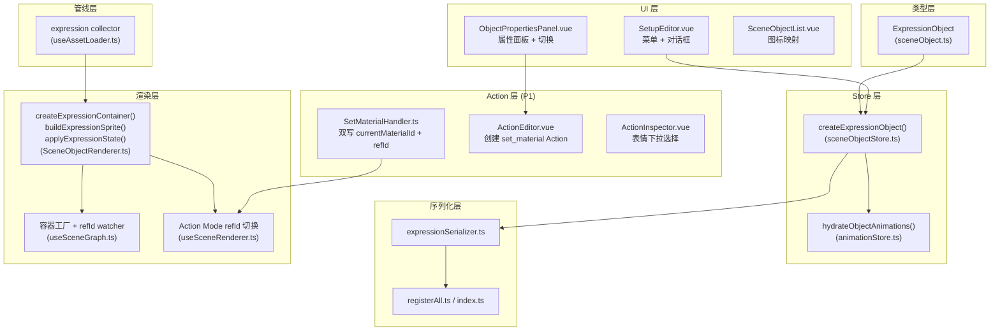

# Expression Scene Object（独立表情场景对象）PRD

> v18 · 2026-03-15

## 1. 概述

Expression Scene Object 是一种独立的场景对象类型，允许将表情资源直接放置到场景画布上，脱离角色系统独立使用。它采用 **引用模式**（`refId` 指向 `expressionStore` 中的表情 ID），支持运行时切换不同表情资源，并在 Action 模式下支持 `set_material` 和 `set_anim` 动作。

### 核心设计决策

| 决策项 | 方案 |
|:--|:--|
| 数据模式 | 引用模式（refId → expressionStore），非自包含 |
| 说话动画 | 通过 `set_anim` action 触发，复用 `frame_sequence` 机制 |
| 资源切换 | 复用 `set_material` action，materialId 映射到 refId |
| 与角色表情的关系 | 完全独立，互不影响 |
| 添加入口 | Setup 模式菜单 → 表情选择对话框 |

---

## 2. 类型定义

```typescript
// types/sceneObject.ts

export type SceneObjectType = '...' | 'expression'

export interface ExpressionObject extends SceneObjectBase {
  type: 'expression'
  refId: string  // → Expression.id (expressionStore)，可变
}
```

- `refId` 为 **可变** 字段，支持运行时切换（区别于大多数对象的静态 refId）
- 继承 `SceneObjectBase` 的全部通用字段（position、scale、rotation、alpha、flipX、zIndex 等）

---

## 3. 架构分层



---

## 4. 文件清单

### P0 — 核心功能（14 文件）

| 层级 | 文件 | 改动类型 | 说明 |
|:--|:--|:--|:--|
| 类型 | `types/sceneObject.ts` | MODIFY | 添加 `'expression'` 联合成员 + `ExpressionObject` 接口 |
| Store | `stores/sceneObjectStore.ts` | MODIFY | 添加 `createExpressionObject()` 工厂函数 |
| Store | `stores/animationStore.ts` | MODIFY | `hydrateObjectAnimations` 添加 expression 分支（创建 frame_sequence 动画） |
| 序列化 | `core/sceneObjectProviders/serialization/expressionSerializer.ts` | **NEW** | 序列化器（serializeFields 为空，refId 由基类处理） |
| 序列化 | `core/sceneObjectProviders/serialization/registerAll.ts` | MODIFY | 注册 expression 序列化器 |
| 序列化 | `core/sceneObjectProviders/serialization/index.ts` | MODIFY | `DeserializeContext` 添加 `createExpressionObject` |
| 渲染 | `core/SceneObjectRenderer.ts` | MODIFY | `createExpressionContainer` / `buildExpressionSprite` / `applyExpressionState` |
| 渲染 | `composables/useSceneGraph.ts` | MODIFY | expression 容器工厂（含纹理预加载）+ refId 变化检测重建 |
| 管线 | `composables/useAssetLoader.ts` | MODIFY | 注册 expression 资源收集器 |
| 管线 | `composables/useSceneRenderer.ts` | MODIFY | Action Mode refId 切换检测（镜像 symbol material 分支） |
| 元数据 | `core/sceneObjectProviders/metadata.ts` | MODIFY | 注册 expression 元数据（😀） |
| UI | `components/SetupEditor.vue` | MODIFY | 菜单项 + ExpressionSelectorDialog |
| UI | `composables/useSetupWorkspace.ts` | MODIFY | 创建逻辑 + refId watcher |
| UI | `components/ObjectPropertiesPanel.vue` | MODIFY | 属性面板 + 切换对话框 |
| UI | `components/SceneObjectList.vue` | MODIFY | 图标映射 |

### P1 — Action 模式（4 文件）

| 层级 | 文件 | 改动类型 | 说明 |
|:--|:--|:--|:--|
| Handler | `utils/actionHandlers/handlers/SetMaterialHandler.ts` | MODIFY | 双写 `state.currentMaterialId` + `state.refId` |
| UI | `components/ActionEditor.vue` | MODIFY | `handleMaterialActionUpdate` + `createNewAction` 支持 expression |
| UI | `components/ObjectPropertiesPanel.vue` | MODIFY | Action 模式下表情切换 emit `materialActionUpdate` |
| UI | `components/ActionInspector.vue` | MODIFY | `targetIsExpression` + expression 下拉列表 |

---

## 5. 实现细节

### 5.1 对象创建

```typescript
// sceneObjectStore.ts
function createExpressionObject(
  expressionId: string,
  name: string,
  customId?: string,
  customAlias?: string
): ExpressionObject
```

- 默认尺寸 200×200，画布中心
- 创建后调用 `hydrateObjectAnimations()` 自动生成 `frame_sequence` 动画定义

### 5.2 渲染流程

#### 创建容器（`createExpressionContainer`）

1. 从 `expressionStore.getExpression(refId)` 获取表情数据
2. 读取 `anchor`、`defaultScale`、`flipHorizontal`、`blendMode`
3. 判断 `speakingFrames` 是否存在：
   - **有帧动画** → 创建 `PIXI.AnimatedSprite`，初始显示 `defaultFrame` 纹理
   - **静态** → 创建 `PIXI.Sprite`，使用 `defaultFrame` 纹理

#### refId 切换（三路同步）

| 场景 | 触发位置 | 机制 |
|:--|:--|:--|
| Setup 模式 | `useSceneGraph.ts` → `updateObjectContainer` | watch refId → 预加载 → `removeChildren` → 重建 sprite |
| Action 模式 | `useSceneRenderer.ts` → `updateActionModeObjects` | 比较 `_renderedRefId` → 预加载 → 重建 |
| 通用（状态应用） | `SceneObjectRenderer.ts` → `applyExpressionState` | 比较 `_renderedRefId` → destroy children → `buildExpressionSprite` |

> 所有路径均保持容器引用不变，仅替换内部 children，从而保持 position/scale/rotation 等变换。

### 5.3 资源预加载

```typescript
// useAssetLoader.ts → collectAssets
expression: (obj) => {
  const expr = expressionStore.getExpression(obj.refId)
  if (expr?.defaultFrame?.url) imageUrls.add(expr.defaultFrame.url)
  for (const frame of expr?.speakingFrames ?? []) {
    if (frame.url) imageUrls.add(frame.url)
  }
}
```

### 5.4 序列化

- **序列化**：`serializeFields` 为空，`refId` 由基类 `toSetupObject` 统一处理
- **反序列化**：调用 `ctx.createExpressionObject(refId, alias, id, alias)` + `ctx.updateObject` 恢复所有字段

### 5.5 说话动画（set_anim）

`animationStore.hydrateObjectAnimations` 为 expression 对象自动创建：

```typescript
{
  type: 'track',
  name: '${alias}_说话动画',
  origin: 'auto',
  loop: true,
  tracks: [{
    trackType: 'frame_sequence',
    assetId: '_self',
    fps: 5,
    loop: true,
  }]
}
```

通过 `set_anim` Action 的 play/stop 控制动画播放。

### 5.6 表情切换（set_material）

**P1 核心设计**：复用 `set_material` action 类型。

```
set_material Action
  └─ params.materialId = 目标表情 ID
       │
       ▼
  SetMaterialHandler.applyToState
  ├─ state.currentMaterialId = materialId  (symbol 读取)
  └─ state.refId = materialId              (expression 读取)
```

- **ActionEditor**：`handleMaterialActionUpdate` 同时接受 `symbol` 和 `expression`
- **ActionInspector**：根据 `targetIsExpression` computed 显示不同下拉列表

---

## 6. UI 交互流程

### 6.1 Setup 模式 — 添加表情

```
菜单栏 → "添加资产" → "😀 表情"
  → ExpressionSelectorDialog
    → 用户选择表情
      → createExpressionObject(expressionId, name)
        → 添加到场景
```

### 6.2 Setup 模式 — 切换表情

```
选中表情对象 → ObjectPropertiesPanel → "切换表情" 按钮
  → ExpressionSelectorDialog
    → 用户选择新表情
      → localObject.refId = newId
        → useSceneGraph 检测变化 → 重建 sprite
```

### 6.3 Action 模式 — 切换表情

```
选中表情对象 → ObjectPropertiesPanel → "切换表情" 按钮
  → ExpressionSelectorDialog
    → 用户选择新表情
      → emit('materialActionUpdate', expressionId)
        → ActionEditor.handleMaterialActionUpdate
          → 创建/更新 set_material Action
```

### 6.4 Action 模式 — 说话动画

```
ActionSequencer → 选择表情对象 → 添加 set_anim Action
  → params: { animations: [{ animName: '说话动画', action: 'play' }] }
    → AnimationController 触发帧序列动画
```

---

## 7. 已知限制

| 项目 | 说明 | 影响 |
|:--|:--|:--|
| 跨 Block 动画重播 | `ScenePlayer.replayCarriedOverAnimations` 的 `objType` 联合不含 `expression`，跨 Block 持续动画不会被重播 | 低（说话动画通常短期触发） |
| FrameCapture `_shouldPlay` | `handleAnimationTriggered` 不管理 expression sprite | 无影响（expression AnimatedSprite 由 renderer 直接管理） |

---

## 8. 测试验证

| 验证项 | 方法 |
|:--|:--|
| TypeScript 编译 | `vue-tsc --noEmit` — ✅ 通过 |
| Setup 添加 | 菜单 → 添加表情 → 画布显示 |
| Setup 切换 | 属性面板 → 切换表情 → sprite 更新，位置保持 |
| 序列化往返 | 保存 → 重新加载 → 表情对象恢复 |
| Action 切换 | Action 模式 → 切换表情 → set_material Action 创建 |
| Action Inspector | 选中 set_material → 表情下拉列表正确显示 |
| 预览渲染 | ScenePlayer 正确渲染表情对象 |
| 视频导出 | FrameCapture 正确渲染表情对象 |
