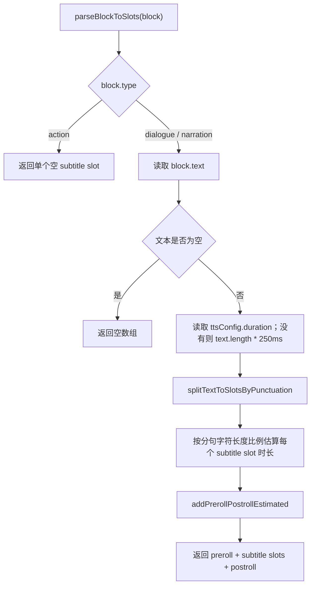

# Slot 拆分系统 PRD

> 版本: v12.11 | 更新日期: 2026-05-15

## 1. 概述

Slot（槽位）是场景编辑器中用于管理脚本块内时间分段和动作锚点的核心概念。当前实现中，`dialogue`（对白）和 `narration`（旁白）使用同一套文本切分逻辑；对白仅在业务语义上额外绑定角色实例，Slot 拆分本身不区分说话人。

本文档描述当前 Slot 拆分逻辑、数据结构、Action 关联机制、字幕显示规则。

---

## 2. 核心数据结构

### 2.1 RuntimeSlot 定义

```typescript
export type SlotType = 'preroll' | 'subtitle' | 'postroll'

export interface RuntimeSlot {
  type: SlotType         // 槽位类型
  index: number          // 槽位序号 (0, 1, 2...)
  text?: string          // 该分句的文本内容，preroll/postroll 无文本
  startTime: number      // 相对于 Block 开始的绝对时间 (ms)
  duration: number       // 该槽位持续时间 (ms)
  isEstimated?: boolean  // 时间是否为估算值
  isMerged?: boolean     // 是否是被合并的显示槽位
  parentIndex?: number   // 如果被合并，指向的主槽位索引
  spanCount?: number     // 如果是主槽位，表示跨越了几个原始槽位
}
```

### 2.2 槽位类型

| 类型 | 说明 |
| --- | --- |
| `preroll` | Block 开始到第一个字幕槽位之前的预留时间段 |
| `subtitle` | 文本分句对应的运行时槽位，也是 Action 最常用的锚点 |
| `postroll` | 最后一个字幕槽位结束到 Block 结束之间的预留时间段 |

---

## 3. 当前 Slot 拆分逻辑

### 3.1 处理流程

当前实现入口是 `parseBlockToSlots(block)`。



当前实现不再使用 TTS 字幕时间戳进行 `aggregateSubtitlesToSlots` 聚合。即使已经生成 TTS 音频，也只使用 `ttsConfig.duration` 作为总时长，再按分句字符长度比例估算每个 Slot 的时长。

### 3.2 旁白与对白的关系

| Block 类型 | Slot 拆分逻辑 | 业务差异 |
| --- | --- | --- |
| `dialogue` | 与旁白完全相同，按文本标点和 `#` 切分 | 有 `instanceId`，用于绑定说话角色、音色快照等 |
| `narration` | 与对白完全相同，按文本标点和 `#` 切分 | 使用旁白音色配置，不绑定角色实例 |
| `action` | 不读取文本，返回 1 个空 `subtitle` slot | 用于纯演出，无 TTS 文本 |

---

## 4. 文本分句规则

### 4.1 运行时 Slot 分句标点

支持以下标点符号作为运行时 Slot 分句依据：

```typescript
const punctuationRegex = /[，,。.！!？?…;；:：\n#]+/
```

| 符号 | 说明 |
| --- | --- |
| `，` `,` | 中英文逗号 |
| `。` `.` | 中英文句号 |
| `！` `!` | 中英文感叹号 |
| `？` `?` | 中英文问号 |
| `…` | 省略号 |
| `;` `；` | 中英文分号 |
| `:` `：` | 中英文冒号 |
| `\n` | 换行符 |
| `#` | 静默分句符 |

连续标点会被视为一个分隔符，避免产生空白分句。分隔符保留在前一个 Slot 的 `text` 中。

示例：

```text
输入文本: 徐小满进入棚中，看着冒烟的灶台，一脸羡慕。

subtitle slots:
1. 徐小满进入棚中，
2. 看着冒烟的灶台，
3. 一脸羡慕。
```

### 4.2 静默分句符 `#`

`#` 用于在不改变 TTS 朗读文本的情况下手动切分运行时 Slot，便于更细粒度地挂动作。

| 场景 | 当前行为 |
| --- | --- |
| Slot 拆分 | `#` 作为分句符，创建新的运行时 Slot |
| TTS 生成 | `#` 会被过滤，不传递给 TTS API |
| 字幕显示 | 仅移除 `#`，普通标点保留 |
| ActionSequencer | Slot 卡片保留 `#`，便于识别手动分句边界 |

示例：

```text
输入文本: 你好#世界。

runtime subtitle slots:
1. 你好#
2. 世界。

TTS 朗读: 你好世界。
预览字幕: 你好世界。
```

---

## 5. 字幕显示规则

### 5.1 Runtime Slot 与 Display Slot

当前系统存在两层 Slot：

| 层级 | 用途 | 规则 |
| --- | --- | --- |
| Runtime Slot | 动作锚点、状态计算、ActionSequencer 编辑 | 每个受支持标点和 `#` 都会切分 |
| Display Slot | 预览和导出时的字幕显示 | 基于 Runtime subtitle slot 再合并，提升字幕可读性 |

这意味着动作可以挂在很细的 runtime slot 上，但观众看到的字幕可能是多个 runtime slot 合并后的句子。

### 5.2 Display Slot 合并规则

显示字幕通过 `buildSubtitleDisplaySlots(slots)` 生成，只处理 `subtitle` 类型 Slot。

主要规则：

- `#` 只作为隐藏控制符，不单独触发显示字幕断句。
- 换行符强制触发显示字幕断句。
- 字幕可读字符数达到 `MAX_SEGMENT_CHARS = 24` 时触发断句。
- 强标点 `[。.！!？?…]` 在可读字符数不少于 `MIN_STRONG_SEGMENT_CHARS = 4` 时触发断句。
- 弱标点 `[，,;；:：]` 在可读字符数不少于 `MIN_WEAK_SEGMENT_CHARS = 14` 时触发断句。
- 过短的尾段会尝试合并到上一个显示字幕中，避免出现极短字幕。

### 5.3 字幕文本清洗

预览播放和视频导出获取字幕文本时，仅移除内部控制符 `#`：

```typescript
export function cleanTextForSubtitle(text: string): string {
  return text.replace(/#/g, '')
}
```

普通标点会保留，以避免改变字幕语义。

---

## 6. 时间计算规则

### 6.1 文本 Block 总时长

`dialogue` 和 `narration` 的总时长按以下优先级确定：

1. 使用 `block.ttsConfig.duration`。
2. 如果没有 TTS 时长，使用 `text.length * 250ms` 估算。

### 6.2 Subtitle Slot 时长估算

文本先按标点切成多个分句。每个分句的初始时长按字符串长度占比分配：

```typescript
slot.duration = Math.floor(totalDuration * segment.length / totalSegmentLength)
```

之后会追加固定预留时间：

| Slot 类型 | 当前时长规则 |
| --- | --- |
| `preroll` | 固定 `100ms` |
| `postroll` | 总时长扣除前面所有 slot 后的剩余时间，通常约 `100ms` |
| `subtitle` | 在扣除 `preroll + postroll` 后，按原估算时长比例缩放 |

### 6.3 Action 时长

Action 使用 `slotIndex` 绑定起始 Slot。

持续动作使用 `slotSpan` 表示跨越多少个 Slot。持续动作的实际时间等于从起始 Slot 开始，累加 `slotSpan` 个 Slot 的 `duration`。

---

## 7. Action 与 Slot 的关联

### 7.1 Action 定位属性

```typescript
export interface BaseAction {
  id: string
  target: string
  type: ActionType
  category: ActionCategory
  slotIndex: number      // 依附的起始槽位下标
}
```

持续动作还有 `slotSpan` 属性表示跨越多少个槽位。

### 7.2 Slot 变更时的 Action 迁移

编辑文本导致 Slot 数量变化时，系统会基于旧 Slot 和新 Slot 的文本指纹检测变更：

- 新 Slot 增加：按插入位置迁移 `slotIndex`，跨越插入点的持续动作扩展 `slotSpan`。
- 旧 Slot 减少：按删除区间迁移 `slotIndex`，跨越删除区间的持续动作收缩 `slotSpan`，最小保留 1。
- 复杂变化：无法精确迁移时执行兜底 clamp，避免 action 指向不存在的 Slot。

核心约束：文本编辑不应静默删除用户已经配置的 Action。

---

## 9. 相关文件索引

| 文件 | 说明 |
| --- | --- |
| [slotUtils.ts](../../src/utils/slotUtils.ts) | Slot 解析、字幕显示、Action 迁移核心逻辑 |
| [ttsClient.ts](../../src/utils/ttsClient.ts) | TTS 客户端，负责过滤 `#` |
| [screenplay.ts](../../src/types/screenplay.ts) | ScriptBlock、RuntimeSlot、TTSConfig 类型定义 |
| [ActionEditor.vue](../../src/components/ActionEditor.vue) | Action Mode 编辑逻辑与文本变更迁移 |
| [ActionSequencer.vue](../../src/components/ActionSequencer.vue) | Slot/Action UI 展示 |
| [ScenePlayer.vue](../../src/components/screenplay/ScenePlayer.vue) | 预览播放字幕显示 |
| [scenePlaybackPipeline.ts](../../src/utils/scenePlaybackPipeline.ts) | 场景播放预计算，共用 Slot 解析结果 |
